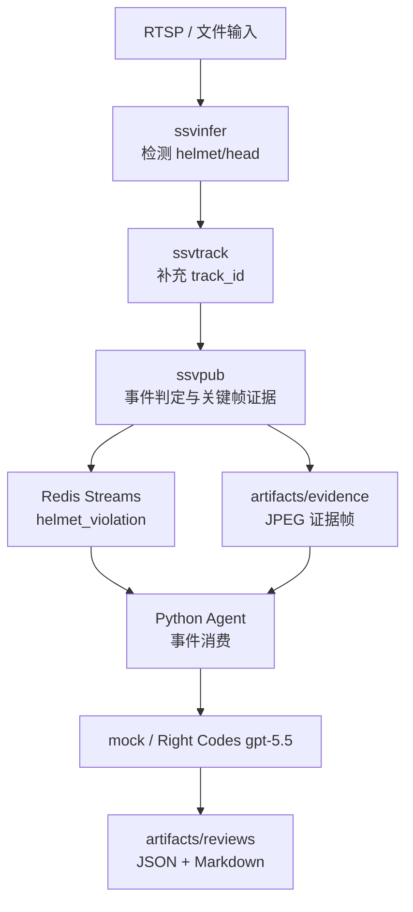

# M4 未佩戴安全帽事件证据与 Agent 复核最小闭环 Spec

## 背景

本任务以 `T3` 事件与异步边界为主，跨 `T4` Agent 与知识复核、`T5` 工程质量，并依赖 `T2` 已冻结的检测与跟踪字段。目标是在现有 `ssvinfer -> ssvtrack -> ssvpub -> Redis -> Agent` 链路上，做出一条最快可验证的“未佩戴安全帽事件 -> 关键帧证据 -> 大模型复核 -> 文字化结果展示”端到端闭环。

按照 `docs/roadmap.md`，M3 负责结构化事件 schema 和安全帽事件规则，M4 负责证据与状态层，M5 负责 Agent 输入与状态机最小闭环，M6 负责工具路由与真实模型复核。本 spec 是面向演示和验证的纵向切片：冻结本闭环需要的最小字段和行为，不替代后续完整 M3/M4/M5/M6 设计。

## 目标

1. 当检测结果中出现 `class == "head"` 时，生成 `helmet_violation` 事件。
2. 将触发事件的当前分析帧保存为 JPEG 证据，并在事件中携带 `evidence.frame_path`。
3. Agent 消费 `helmet_violation` 事件，构造复核上下文，调用 mock provider 或真实 Right Codes OpenAI-compatible provider。
4. 真实 provider 使用 `https://right.codes/codex/v1` 和模型 `gpt-5.5`，兼容 OpenAI 格式。
5. 大模型根据证据帧和检测元数据返回最终判断。
6. Agent 生成结构化 JSON 结果和 Markdown 文字展示结果。

## 非本阶段范围

1. 不建设完整前端 UI。
2. 不实现完整报告系统、通知系统或工单系统。
3. 不实现向量检索、规则知识库和多轮知识问答。
4. 不实现完整 Agent 状态机的全部迁移和长期状态存储。
5. 不保存原始 RTSP 码流中的全分辨率帧；本阶段保存进入 `ssvpub` 的当前分析帧。
6. 不实现短视频片段证据。
7. 不引入独立 `ssvevent` 插件；本阶段允许 `ssvpub` 承担最小事件判定和关键帧保存。

## 主线与接口影响

| 主线 | 影响 |
| --- | --- |
| `T2` | 读取 `SsvDetection` 的 `class_name`、`class_id`、`confidence`、`bbox`、`track_id`、`track_state`、`occluded`，不修改元数据结构。 |
| `T3` | 新增 `helmet_violation` 事件、证据路径字段、证据失败降级语义。 |
| `T4` | Agent 新增事件解析、复核上下文、provider 调用、结果输出。 |
| `T5` | 新增 C++ 与 Python 单测、可选真实 provider 验证入口。 |

## 架构



`ssvpub` 在 `transform_ip` 中同时拿到当前 `GstBuffer` 和已跟踪检测结果。检测结果中存在 `class == "head"` 时，`ssvpub` 保存当前 BGR 分析帧为 JPEG，并发布 `helmet_violation` 事件。Agent 只消费 Redis 事件和证据文件，不进入每帧同步检测链路。

当前分析帧是 pipeline 中已解码、缩放到 `pipeline.frame_width` 和 `pipeline.frame_height`、BGR 格式的帧。该帧与检测 bbox 使用同一坐标体系，适合后续视觉复核。

## 事件触发规则

1. 单帧内任意检测项满足 `class == "head"` 时，触发一条 `helmet_violation` 事件。
2. 单帧内多个 `head` 检测合并为同一事件，事件中保留所有触发检测。
3. `helmet` 检测不触发违规事件。
4. 未出现 `head` 时不发布 `helmet_violation`。
5. 后续连续命中、低置信度、检测冲突等复杂规则不在本阶段实现。

## Redis 事件 schema

事件写入现有 Redis Stream key，默认 `ssv:events`。事件字段仍使用 Redis field `event` 承载 JSON 字符串。

```json
{
  "schema_version": "m4.helmet_violation.v1",
  "type": "helmet_violation",
  "event_id": "camera-1:12345:1700000000000",
  "source": "camera-1",
  "timestamp_ms": 1700000000000,
  "frame_id": 12345,
  "severity": "warning",
  "trigger_reason": "head_detected",
  "detections": [
    {
      "class": "head",
      "class_id": 1,
      "confidence": 0.86,
      "bbox": [0.1, 0.2, 0.3, 0.5],
      "track_id": 7,
      "track_state": 1,
      "occluded": false
    }
  ],
  "evidence": {
    "frame_path": "artifacts/evidence/camera-1/1700000000000-frame-12345.jpg",
    "frame_format": "jpeg",
    "frame_width": 640,
    "frame_height": 480,
    "missing_reason": null
  },
  "agent_state": "pending"
}
```

字段语义：

| 字段 | 类型 | 语义 |
| --- | --- | --- |
| `schema_version` | string | 本阶段固定为 `m4.helmet_violation.v1`。 |
| `type` | string | 本阶段违规事件固定为 `helmet_violation`。 |
| `event_id` | string | 由 `source`、`frame_id`、`timestamp_ms` 组成，单机原型内唯一。 |
| `severity` | string | 本阶段固定为 `warning`。 |
| `trigger_reason` | string | 本阶段固定为 `head_detected`。 |
| `detections` | array | 触发事件的 `head` 检测列表，字段来自 `SsvDetection`。 |
| `evidence.frame_path` | string 或 null | JPEG 证据帧路径。 |
| `evidence.missing_reason` | string 或 null | 证据缺失或写入失败原因。 |
| `agent_state` | string | 初始为 `pending`；证据缺失时为 `manual_review`。 |

## 证据输出

证据目录默认使用 `artifacts/evidence/`，按 source 分目录：

```text
artifacts/evidence/<source>/<timestamp_ms>-frame-<frame_id>.jpg
```

路径中的 `source` 需要做文件名安全处理，只保留字母、数字、点、下划线和短横线，其他字符替换为 `_`。如果 source 为空，使用 `unknown`。

JPEG 证据帧来自 `ssvpub` 当前输入 buffer。保存失败时仍发布 `helmet_violation` 事件，事件中：

```json
{
  "evidence": {
    "frame_path": null,
    "frame_format": "jpeg",
    "frame_width": 640,
    "frame_height": 480,
    "missing_reason": "write_failed"
  },
  "agent_state": "manual_review"
}
```

## Agent 复核上下文

Agent 只处理 `type == "helmet_violation"` 的事件。其他 detection 消息保持现有消费日志能力，不进入大模型复核。

Agent 构造 `ReviewContext`：

| 字段 | 来源 | 语义 |
| --- | --- | --- |
| `event_id` | 事件 | 复核任务 ID。 |
| `source` | 事件 | 视频源标识。 |
| `frame_id` | 事件 | 触发帧 ID。 |
| `timestamp_ms` | 事件 | 事件时间戳。 |
| `trigger_reason` | 事件 | 触发原因。 |
| `detections` | 事件 | 触发检测列表。 |
| `frame_path` | `evidence.frame_path` | 证据帧路径。 |
| `provider` | 配置 | `mock` 或 `right_codes`。 |
| `model` | 配置 | mock 名称或 `gpt-5.5`。 |

证据文件缺失、不可读或 `evidence.missing_reason` 非空时，Agent 不调用真实 provider，直接输出 `manual_review`。

## Provider 配置

新增 Agent 模型配置：

```yaml
agent:
  state_machine_timeout: 300
  max_retries: 3
  model:
    provider: "mock"
    base_url: "https://right.codes/codex/v1"
    model: "gpt-5.5"
    api_key_env: "RIGHT_CODES_API_KEY"
    timeout_seconds: 60
```

运行时约定：

1. `provider=mock` 时不读取 API key，不访问网络，返回稳定结构化结果。
2. `provider=right_codes` 时使用 OpenAI-compatible API。
3. API key 从 `RIGHT_CODES_API_KEY` 读取。
4. API key 缺失、超时、限流、非 JSON 响应或字段缺失时，输出 `manual_review`，并记录错误摘要。
5. 单测默认使用 `mock`，真实调用必须显式配置环境变量后运行。

## 提示词设计

提示词由 system message 和 user message 组成。

system message：

```text
你是工地安全视频复核助手。你只能基于提供的图片证据和检测元数据判断，不得编造图片外信息。任务是确认触发目标是否未佩戴安全帽。如果图片看不清、目标被遮挡、目标不完整、检测框明显不可信或证据不足，必须返回 manual_review。输出必须是严格 JSON，不要输出 Markdown。
```

user message 包含事件上下文、检测列表和图片证据：

```text
请复核以下安全帽违规事件。

event_id: <event_id>
source: <source>
frame_id: <frame_id>
trigger_reason: head_detected
detections:
- class=head, confidence=<confidence>, bbox=[x1,y1,x2,y2], track_id=<track_id>

请判断触发目标是否未佩戴安全帽。只输出符合约定 schema 的 JSON。
```

真实调用时附加证据图片。bbox 使用归一化坐标 `[x1, y1, x2, y2]`，与证据帧同一坐标体系。

## 复核结果 schema

Agent provider 返回或归一化为以下 JSON：

```json
{
  "event_id": "camera-1:12345:1700000000000",
  "final_decision": "violation_confirmed",
  "confidence": 0.84,
  "reasoning_summary": "触发区域内人员头部未见安全帽覆盖。",
  "evidence_description": "画面中可见一名人员头部裸露，附近没有明显安全帽。",
  "recommended_action": "建议现场提醒并复查该时间点视频。",
  "provider": "right_codes",
  "model": "gpt-5.5",
  "error": null
}
```

`final_decision` 只允许三种值：

| 值 | 语义 |
| --- | --- |
| `violation_confirmed` | 模型确认未佩戴安全帽。 |
| `no_violation` | 模型认为触发目标已佩戴安全帽或检测误触发。 |
| `manual_review` | 证据不足、模型失败或需要人工复核。 |

## 文字化展示

Agent 每次复核后输出两个文件：

```text
artifacts/reviews/<safe_event_id>.json
artifacts/reviews/<safe_event_id>.md
```

`safe_event_id` 由 `event_id` 做文件名安全处理得到，只保留字母、数字、点、下划线和短横线，其他字符替换为 `_`。


JSON 文件保存结构化复核结果。Markdown 文件保存人可读摘要，至少包含：

1. 事件 ID。
2. 视频源和帧 ID。
3. 最终判断。
4. 置信度。
5. 触发原因。
6. 证据图片路径。
7. 复核说明。
8. 建议动作。
9. provider 和模型名。

Agent 日志打印最终判断和 Markdown 文件路径，作为第一版“可视化展示”。

## ACK 与失败语义

| 场景 | 行为 |
| --- | --- |
| malformed JSON | 保持现状，不 ACK。 |
| 非 `helmet_violation` 事件 | 记录 detection 日志，ACK。 |
| 证据缺失或不可读 | 写出 `manual_review` 结果，ACK。 |
| API key 缺失 | 写出 `manual_review` 结果，ACK。 |
| 模型超时或限流 | 写出 `manual_review` 结果，ACK。 |
| 模型返回非 JSON | 写出 `manual_review` 结果，ACK。 |
| 结果文件写入失败 | 不 ACK，等待后续重试。 |

写出失败结果后 ACK，可以避免同一坏事件反复阻塞 consumer。只有事件无法解析或结果无法落盘时保留未 ACK。

## 配置项

本阶段新增或使用以下配置：

| 配置 | 默认值 | 语义 |
| --- | --- | --- |
| `events.helmet_violation.enabled` | `true` | 是否启用未佩戴安全帽事件。 |
| `events.helmet_violation.trigger_class` | `head` | 触发违规事件的类别名。 |
| `events.helmet_violation.publish_detection_events` | `true` | 是否继续发布普通 detection 消息。 |
| `evidence.output_dir` | `artifacts/evidence` | 证据帧输出目录。 |
| `reviews.output_dir` | `artifacts/reviews` | Agent 复核结果输出目录。 |
| `agent.model.provider` | `mock` | `mock` 或 `right_codes`。 |
| `agent.model.base_url` | `https://right.codes/codex/v1` | OpenAI-compatible endpoint。 |
| `agent.model.model` | `gpt-5.5` | 真实视觉复核模型。 |
| `agent.model.api_key_env` | `RIGHT_CODES_API_KEY` | API key 环境变量名。 |
| `agent.model.timeout_seconds` | `60` | 模型调用超时时间。 |

配置落地时需要同步 `config/ssv.default.yaml`、`config/ssv.example.yaml` 和 Agent 配置模型。`scripts/pipeline.sh` 可通过环境变量把事件和证据相关配置传给 `ssvpub` 插件。

## 测试与验收

C++ 测试：

1. `head` 检测触发 `helmet_violation` payload。
2. 无 `head` 检测不触发违规事件。
3. 多个 `head` 检测合并为单条事件。
4. `track_id`、`track_state`、`occluded` 透传到事件。
5. 证据保存失败时 payload 包含 `missing_reason` 且 `agent_state=manual_review`。

Agent 测试：

1. 解析完整 `helmet_violation` 事件并构造 `ReviewContext`。
2. 证据缺失时输出 `manual_review`，不调用真实 provider。
3. `mock` provider 返回稳定结构化结果。
4. `right_codes` provider 在 API key 缺失时输出 `manual_review`。
5. provider 返回非 JSON 或缺字段时输出 `manual_review`。
6. 成功复核后生成 JSON 和 Markdown 文件。
7. 结果文件写入失败时不 ACK。

集成验收：

1. 构造本地测试 JPEG 和 Redis-like 事件，Agent 运行后生成 `artifacts/reviews/<safe_event_id>.json` 和 `.md`。
2. 有 `RIGHT_CODES_API_KEY` 且显式启用真实调用时，使用 `gpt-5.5` 完成一次视觉复核。
3. 默认测试不依赖外部 API，不访问网络。

推荐验证命令：

```bash
./ssv build
meson test -C build
cd agent && uv run --extra dev pytest
bash tests/ssv_cli_test.sh
```

真实链路验证依赖 RTSP、模型、Redis 和 API key：

```bash
./ssv redis
RIGHT_CODES_API_KEY=<key> ./ssv agent
SSV_LABEL_MAP=config/model-labels/helmet.txt SSV_TARGET_CLASS= ./ssv run
```

## 兼容性与后续演进

1. 现有 `type=detection` 消息保持兼容，Agent 仍可按现有方式记录日志。
2. `helmet_violation` 是新增事件类型，不改变 `SsvDetection` 元数据结构。
3. `ssvpub` 承担事件判定和证据输出是本阶段最小闭环实现。后续事件规则变复杂时，可拆出独立 `ssvevent` 插件，`ssvpub` 退回纯发布职责。
4. 后续 M5 可把本阶段的 `ReviewContext` 扩展为完整状态机上下文。
5. 后续 M6 可把 `VisionReviewClient` 接入工具路由，并增加更多 provider。
6. 后续 M7 可基于 Markdown 结果扩展报告模板和规则解释。
