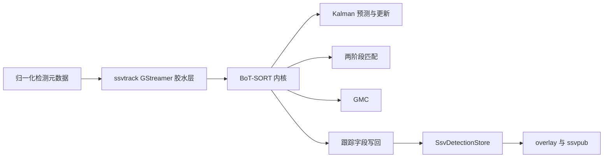
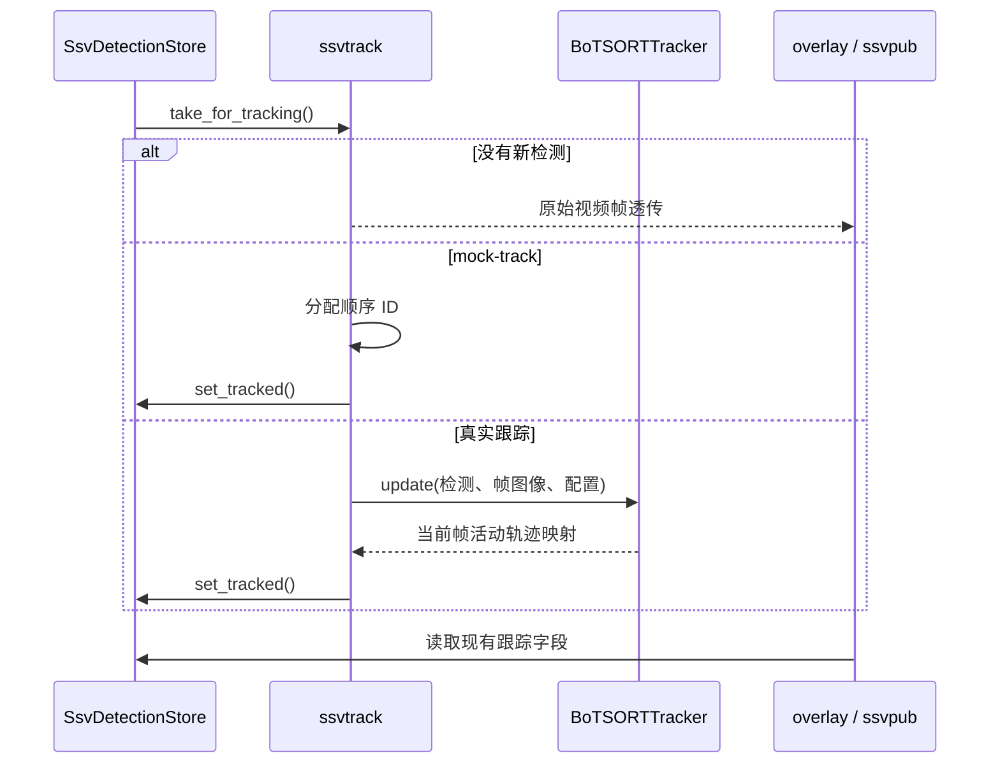

# T2 BoT-SORT 迁移与一致性验证 spec

## 背景

当前 `gst/ssv-track` 使用仓内 IoU tracker：按 IoU 贪心匹配、简单速度预测和固定保留窗口生成 `track_id`。该实现不能提供 BoT-SORT 的 Kalman 运动模型、两阶段关联、轨迹生命周期管理和全局运动补偿（GMC）。

历史分支 `feat/add-BoT-SORT` 的提交 `9e6d478` 已完成一次仓内 BoT-SORT Lite 移植，但该分支不再作为开发基线。本阶段在 `feat/tracking-BoT-SORT` 上复用该提交，并以 `/mnt/work/BoT-SORT` 仓库 `feat/python-to-cpp` 分支开始实施时的 HEAD 为固定算法基准，完成适配、代码审查和可复现的一致性验证。

本工作属于 `T2` 感知算法与元数据主线。

## 目标

1. 以 `9e6d478` 为迁移起点，使 `ssvtrack` 默认真实跟踪路径使用 BoT-SORT，而非当前 IoU tracker。
2. 保留 `mock-track` 作为显式旁路，并保持所有既有数据契约、运行边界和消费者兼容。
3. 对已移植的 BoT-SORT 功能建立与上游 C++ 基准的一致性证据，包括确定性跨仓库对照测试与逐项代码审查。
4. 在本仓构建、单元测试和插件测试中验证算法内核及 GStreamer 写回路径。

## 非本阶段范围

1. ReID、embedding、跨摄像头跟踪、多类别追踪扩展、轨迹级 Redis 消息和 Python 运行时依赖。
2. 修改 `SsvDetectionStore` 状态机、bbox 坐标格式、Redis detection JSON schema、Agent 输入输出或 pipeline runner 职责。
3. 未由旧提交移植，且未纳入本阶段适配的上游功能；这些功能不进入一致性承诺或测试范围。
4. 根据单条真实流确定 GMC 的最终生产默认值；本阶段只保证已启用 GMC 的行为可验证、不可用时安全降级。

## 总体设计



### 模块边界

- `gst/ssv-track/botsort/`：保存算法内核。Kalman、匹配、轨迹对象、GMC 和 tracker 独立于 GStreamer，可被直接单测和对照测试。
- `gst/ssv-track/gstssvtrack.cpp`：仅承担属性读取、tracker 生命周期、检测数据适配、帧图像交接和跟踪字段写回。
- `gst/tests/`：保存算法单测、插件属性测试、元数据写回回归和跨仓库对照测试。
- `docs/specs/`：记录上游固定 SHA、已移植范围、审查矩阵、差异及验证结果。

### 类关系与属性归属

不让 BoT-SORT 继承当前 `IoUTracker`。该类是 `gstssvtrack.cpp` 内部的简化实现，其匹配和状态假设不构成可复用基类。`SsvTrack` 继续继承 `GstBaseTransform`，以保留现有 GObject 属性、生命周期回调和 pipeline 行为；它以组合方式持有 `BoTSORTConfig` 与 `BoTSORTTracker`。

```text
SsvTrack : GstBaseTransform
  ├─ GObject 属性与 mock-track 旁路
  ├─ BoTSORTConfig
  └─ BoTSORTTracker
       ├─ KalmanFilter
       ├─ STrack 集合
       ├─ matching
       └─ GMC
```

`BoTSORTTracker`、`STrack`、Kalman、matching 和 GMC 均为独立普通 C++ 类型，不依赖 `Gst*`、`SsvDetectionStore`、Redis 或 `IoUTracker`。内核方法只接受算法 DTO、配置与可选图像视图，返回轨迹结果 DTO；插件层负责 DTO 与 `SsvDetection` 的双向转换。

现有 `frame-rate`、`track-thresh`、`track-buffer`、`match-thresh` 和 `mock-track` 保持名称及既有语义，并映射进 `BoTSORTConfig` 或旁路逻辑。高/低分阈值、新轨迹阈值、GMC 方法与下采样作为 `SsvTrack` 的新增 GObject 属性，再映射进同一配置对象；它们不成为 `IoUTracker` 或 GStreamer 以外算法类的继承接口。

新增成员按职责分层管理：

| 归属 | 成员与规则 |
| --- | --- |
| `SsvTrack` 配置层 | 保留 `frame-rate`、`track-thresh`、`track-buffer`、`match-thresh`、`mock-track`；新增 `track-low-thresh`、`track-high-thresh`、`new-track-thresh`、`gmc-method`、`gmc-downscale`。它们是 GObject 属性，具有默认值和范围校验。 |
| `BoTSORTConfig` | `start()` 时由插件属性生成的普通 C++ 配置快照，作为构造 `BoTSORTTracker` 的唯一配置输入。 |
| `BoTSORTTracker` 运行时层 | `frame_id`、下一轨迹 ID、active/lost/removed 轨迹集合、Kalman、GMC、匹配临时数据等私有算法状态。它们不暴露为插件属性，不写入检测元数据，也不由 `SsvTrack` 逐项维护。 |

新增 BoT-SORT 属性只允许在 tracker 创建前生效；运行中不得以动态重建或局部替换方式改变 tracker 配置，以免同一轨迹生命周期混用不同阈值。现有属性的兼容行为不因本阶段改变。

## 数据契约与兼容性

`SsvDetection`、`SsvFrameDetections`、`SsvDetectionStore` 和 Redis detection JSON 的字段、类型及状态机规则保持不变。BoT-SORT 只在现有字段中写入：

| 字段 | 本阶段规则 |
| --- | --- |
| `track_id` | 活动轨迹从 `1` 起分配；当前帧未获得活动轨迹的检测保持 `-1`。 |
| `track_state` | 新建活动轨迹写 `SSV_TRACK_NEW`；已关联活动轨迹写 `SSV_TRACK_MATCHED`。内核 LOST/DEAD 不生成虚构 detection。 |
| `occluded` | 沿用现有布尔字段和下游透传方式；其赋值规则在实现中与 BoT-SORT 输出映射一并固定并测试。 |
| bbox、类别、置信度 | 保持现有归一化 `x1y1x2y2`、`class_id`、`confidence` 语义，不由跟踪器重定义。 |

`mock-track` 仍为每帧顺序分配 ID 的联调旁路，默认值和显式启用方式不变。新增的 BoT-SORT 阈值与 GMC 设置为 `ssvtrack` 属性；已有属性名和语义不变。若 YAML 暴露新增属性，必须同步文档和测试，但不得修改既有配置键。

## 每帧数据流与异常处理



1. 插件取得新检测后，依据协商后的帧宽高将归一化 bbox 转为像素坐标，再将现有检测字段适配为内核输入；内核运行预测、可选 GMC、两阶段关联和轨迹生命周期更新。结果回写前再转回归一化坐标。
   `GstBuffer` 的 BGR 像素映射、stride/尺寸检查及图像视图构造由插件层完成，内核不得访问 GStreamer 对象。
2. 低分检测仅按 BoT-SORT 两阶段关联规则参与既有轨迹续接；未达到新建轨迹条件者保持未跟踪。
3. GStreamer 层在 `start` 创建 tracker，在 `stop` 和 `finalize` 安全释放；半初始化不得保留可用指针。
4. 空输入或无新检测时直接透传视频帧，不推进伪造状态。
5. GMC 计算失败、输入不可用或变换退化时记录诊断并退化为单位变换/无补偿，不中断 pipeline。退化行为必须可测试。
6. 属性值通过 GObject 范围约束；内核仍须安全处理空集合、退化框和无可用图像。

## 上游基准与一致性验证

实施开始时记录：

- 基准仓库：`/mnt/work/BoT-SORT`
- 基准分支：`feat/python-to-cpp`
- 基准提交：`1f7d73314e9e14148fb4acf597997c7e5d0bb455`

对照测试不得在执行时依赖该外部工作区。测试应将共享输入、配置和期望结果纳入本仓，或由受版本控制的生成步骤在迁移时固化输出。每帧比较使用明确的浮点容差，并覆盖：

| 组件 | 对照内容 |
| --- | --- |
| Kalman | 8 维状态的初始化、预测、更新及协方差演化。 |
| matching | IoU 距离、阈值过滤和 Hungarian 匹配的索引结果。 |
| tracker | 高低分两阶段关联、激活/重激活/丢失/移除集合、轨迹 ID、状态和 bbox 输出。 |
| GMC | 已移植方法的变换矩阵、坐标补偿和失败降级。 |
| GStreamer 写回 | 内核活动轨迹到 `track_id`、`track_state`、`occluded` 的映射，以及 store 流转不变。 |

源仓库没有对应输出接口或本阶段未移植的功能，必须在审查矩阵中标为“不适用”，并说明原因；不能以模糊的“基本一致”替代逐项结论。

## 代码审查要求

审查以当前适配后的代码、`9e6d478` 和上游固定 SHA 三方比对为依据，至少覆盖：

1. Kalman 状态维度、状态转移矩阵、观测矩阵、噪声权重、预测和更新顺序。
2. IoU 计算、代价矩阵、Hungarian 分配、匹配阈值和无效匹配处理。
3. 高/低分检测拆分、第一与第二关联阶段、新轨迹阈值、轨迹激活、丢失、重激活和移除条件。
4. GMC 图像格式、下采样、估计方法、仿射变换应用和错误退化。
5. GStreamer 生命周期、属性映射、帧边界、元数据写回与现有契约的隔离。

审查结论单独以中文文档保存。每一项只可标注“一致”“有意差异”或“不适用”；“有意差异”必须说明不影响的原因并由测试覆盖。

## 测试与验收

1. 保留并适配旧提交的 Kalman、matching、GMC、tracker 和插件属性测试。
2. 新增跨仓库确定性对照测试，以及 plugin 到 `SsvDetectionStore` 的写回回归。
3. 运行：

```bash
./ssv build
meson test -C build
```

4. 本地模型、RTSP 和 Redis 环境可用时，再运行 `./ssv test` 或等价有界链路验证；环境缺失时记录未执行项及原因。
5. 验收通过条件：默认真实路径已不再实例化 IoU tracker；所有已移植组件都有审查结论和确定性对照证据；数据契约回归测试通过；上述可执行验证命令通过。

## 实施顺序

1. 固定并记录上游 SHA，审阅 `9e6d478` 影响范围及当前分支冲突。
2. 迁移旧提交，处理构建、插件和接口适配。
3. 建立对照输入与基线，补齐单测、插件回归和审查矩阵。
4. 运行构建、测试和可用的链路验证，记录结果。
5. 输出审查结论和迁移说明。
