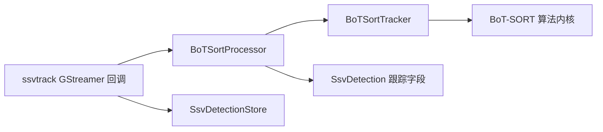

# T2 BoT-SORT 处理器封装 spec

## 背景与目标

`gst/ssv-track/gstssvtrack.cpp` 当前同时承担 GObject 属性和生命周期、GStreamer 视频帧映射、检测数据转换、归一化坐标与像素坐标转换、BoT-SORT 调用及结果回写。这使插件回调与算法接入细节交织，不利于阅读、修改和独立测试。

本工作属于 `T2` 感知算法与元数据主线。目标是在不改变运行行为和对外数据契约的前提下，将 BoT-SORT 的接入处理收拢到独立的 `BoTSortProcessor` 中。`gstssvtrack.cpp` 继续承担 GStreamer 插件职责，并沿用 `gst/ssv-infer/gstssvinfer.cpp` 的模式：插件公开并保存运行参数，在 `start()` 时组装算法配置，再创建运行时对象。

## 范围

本阶段新增以下文件：

```text
gst/ssv-track/botsort/botsort_processor.hpp
gst/ssv-track/botsort/botsort_processor.cpp
```

并修改：

```text
gst/ssv-track/gstssvtrack.cpp
gst/ssv-track/meson.build
gst/tests/test_gst_plugins.cpp
```

本阶段不引入用于选择多种跟踪算法的虚接口、工厂或策略模式；`BoTSortProcessor` 仅解决当前 BoT-SORT 接入代码的边界问题。`mock-track` 继续由 `gstssvtrack.cpp` 处理，保持其作为插件测试快捷路径的现有语义。

## 设计

### 组件职责



| 组件 | 职责 |
| --- | --- |
| `gstssvtrack.cpp` | BoT-SORT GObject 属性的定义、默认值、读写和校验；`start/stop` 生命周期；从属性组装 `TrackerConfig`；`SsvDetectionStore` 读写、caps 尺寸读取、`GstVideoFrame` 映射和解除映射、`mock-track` 分支。 |
| `BoTSortProcessor` | 将 `SsvDetection` 转为 BoT-SORT 输入、执行归一化坐标与像素坐标互转、按可选 `FrameView` 调用 `BoTSortTracker`、仅回写三项跟踪字段。 |
| `BoTSortTracker` | 保持既有 BoT-SORT 算法内核：检测分流、关联、Kalman、GMC 和轨迹生命周期。 |

`BoTSortProcessor` 放在 `botsort/` 中，表示它是 BoT-SORT 的接入处理器；它可依赖 `ssv_meta.hpp`，但不得依赖 GStreamer 头文件。GStreamer buffer 映射必须继续在插件边界完成。

### 参数配置边界

`ssvtrack` 的 `frame-rate`、`track-thresh`、`track-buffer`、`match-thresh`、`track-low-thresh`、`track-high-thresh`、`new-track-thresh`、`gmc-method`、`gmc-downscale` 与 `mock-track` 均继续作为插件 GObject 属性定义在 `gstssvtrack.cpp`。其属性默认值、`set_property()` / `get_property()`、字符串内存管理及 `GST_PARAM_MUTABLE_READY` 约束保持现状。

插件以 `make_botsort_config(const SsvTrack *)` 将这些属性转换为 `TrackerConfig`，并在常规 `start()` 分支中传给 `BoTSortProcessor` 构造函数。这与 `ssv_infer_make_config()` 在插件层读取属性、向 `InferenceEngine::start()` 传递 `InferenceConfig` 的职责划分一致。

`BoTSortProcessor` 不定义 GObject 属性、不保存第二份默认参数，也不解析 `gmc-method` 字符串；它只接受已完成解析的 `TrackerConfig`。对插件公开的处理调用仅为 `process()`；检测转换、坐标适配、`FrameView` 使用、算法更新与三项字段回写均为 processor 的私有实现。因此，管线配置和 `gst-inspect` 的可见接口仍由插件维护，而算法处理器可保持独立、可直接单测。

### 接口和所有权

处理器提供单一的跨帧处理接口：

```cpp
class BoTSortProcessor {
public:
    explicit BoTSortProcessor(TrackerConfig config);

    void process(std::vector<SsvDetection>& detections,
                 int frame_width,
                 int frame_height,
                 const std::uint8_t* frame_data = nullptr,
                 std::size_t frame_stride = 0);

private:
    BoTSortTracker tracker_;
};
```

`SsvTrack` 保留 GObject C 结构体使用裸指针的既有模式，将 `botsort::BoTSortTracker *tracker` 替换为 `botsort::BoTSortProcessor *processor`：

- `start()` 调用插件层的 `make_botsort_config(self)`，根据现有属性生成 `TrackerConfig` 并创建 `processor`；
- `stop()` 删除 `processor` 并置空；
- `process()` 由 processor 内部以值成员持有的 `BoTSortTracker` 调用；
- `mock-track=true` 时不创建 processor，语义保持不变。

这避免在 GObject 的 C 结构体中嵌入 C++ RAII 成员，也避免插件层直接管理算法内核对象。

### 处理流程

1. 插件从 `SsvDetectionStore` 取得本帧检测并判断空帧快捷返回。
2. `mock-track=true` 时按原逻辑分配连续 ID 并写回。
3. 常规模式下，插件读取当前 caps 的宽高；仅当 GMC 已启用且视频帧映射成功时取得 BGR 数据指针和 stride。
4. 插件调用 `processor->process(det.detections, width, height, frame_data, frame_stride)`；映射失败时传入空指针和零 stride，处理器调用无帧的既有 BoT-SORT 更新路径。
5. 插件解除 `GstVideoFrame` 映射、释放 caps，并将检测包写回 `SsvDetectionStore`。

处理器内部保留现有转换规则：在数据指针可用时创建专用的 `FrameView`；进入算法前转换为像素坐标；算法结果转换回归一化坐标仅用于维持既有处理过程；最终只将原始输入索引对应的 `track_id`、`track_state`、`occluded` 写回调用方的检测对象。

## 不变约束

1. `SsvDetection`、`SsvDetectionStore`、Redis detection JSON、bbox 归一化格式，以及全部既有 BoT-SORT 插件属性的名称、类型、默认值、可变阶段和语义保持不变。
2. 下游可见 bbox、类别、类别名和置信度不得被处理器修改。
3. `gmc-method=none` 仍走无帧 `update()`；GMC 帧不可用时的 warning 与无帧回退语义保持不变。
4. `BoTSortTracker`、Kalman、匹配、GMC 和 LAPJV 的算法逻辑不在本阶段修改。
5. 不新增多算法抽象；未来接入其他算法时另行设计其选择机制与元数据语义。

## 错误处理与日志

处理器不拥有或释放 `GstCaps`、`GstBuffer`、`GstVideoFrame`。尺寸无效或没有可用帧数据时，处理器沿用现有无帧更新路径；GMC 帧映射失败的诊断日志仍由插件层发出，因为只有该层知道 GStreamer 映射状态。

## 验证

1. 编译确认 Meson 将 `botsort_processor.cpp` 纳入 `ssvtrack` 插件。
2. 扩展或保持插件回归，覆盖普通跟踪、`mock-track`、`gmc-method=none` 和 GMC 帧不可用回退。
3. 运行现有 BoT-SORT 内核测试，确认算法输出未因封装变化而改变。
4. 运行 `./ssv build` 和可执行的 `meson test -C build`；若 TensorRT 运行时缺失阻断插件扫描，单独报告该环境问题，并给出可执行的相关测试结果。

## 验收标准

1. `gstssvtrack.cpp` 不再包含 `SsvDetection` 与 `botsort::Detection` 的转换函数、坐标转换调用或结果回写循环。
2. `gstssvtrack.cpp` 不再直接创建或调用 `botsort::BoTSortTracker`。
3. `BoTSortProcessor` 不包含任何 GStreamer 头文件或 GStreamer buffer 生命周期操作，且 `FrameView` 不出现在其对插件的公开调用接口中。
4. 插件属性、`mock-track`、GMC 回退和三项跟踪字段写回的行为与重构前一致。
5. 相关构建和可执行测试通过，或明确记录与本重构无关的环境阻断。

## 非本阶段范围

1. 支持 ByteTrack、DeepSORT 或其他跟踪算法。
2. 对跟踪算法设置动态切换的属性、工厂或虚接口。
3. 修改 BoT-SORT 算法参数、匹配策略、GMC 实现或测试基准。
4. 修改任何跨主线接口或下游消费逻辑。
