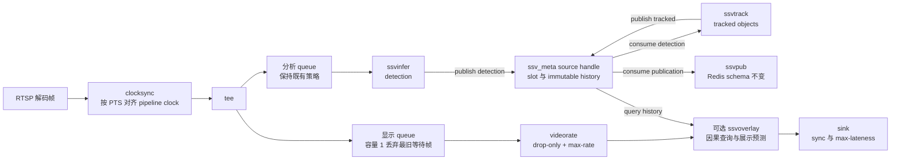

# T1/T2 最新帧显示与基于 PTS 的展示预测 spec

## 文档定位

本文是本次 T1/T2 交付的唯一需求契约，统一描述：

- T1 的 latest-frame 显示分支、YAML 和插件属性接线；
- T2 的媒体时间、generation、感知元数据传递、展示运动预测、renderer 与 runtime；
- frame types、timeline、result channels 收敛到 `ssv_meta` 后的最终 common interface。

本文替代本次交付此前拆分的三份 spec。实现与测试只以本文描述的最终结构为准，不再保留
过渡期公共接口。

本次交付的设计增量、运行配置说明和验证结论只写入本文及配套 plan。README、既有专题说明
和更早日期的 spec/plan 保持历史快照，不随本次实现改写。

## 背景

实时 pipeline 在 `tee` 后把显示与分析拆成两个分支。旧显示分支允许过时 buffer 排队，
而旧 overlay 只能读取最近一次 tracked 快照，无法判断结果对应哪个媒体时间。分析链路为
5 FPS、显示链路约 30 FPS 时，移动目标的显示框可能落后画面 100–300 ms。

此前 common 又把结果时序拆成 `ssv_meta`、timeline 和 result channels 多套公共对象，插件
adapter 需要同时协调 source、generation、mailbox、fanout 和 history，接口复杂且容易出现
部分发布或跨代读取。

本阶段把两条问题作为一个完整展示链路解决：T1 只保留最新待显示帧并按 pipeline clock
播放；T2 使用媒体 PTS 选择因果 tracked snapshot，并只在展示侧做短时运动预测；common
只通过 `ssv_meta(source_id)` 取得 source-scoped `SsvSourceMeta`，由它隐藏全部共享状态。

## 目标

1. 视频保持 1× 播放，不通过固定延迟或减速换取框与画面对齐。
2. 显示分支采用非抢占式 latest-frame-wins：当前帧处理完成后，等待队列只保留最新一帧。
3. overlay 只选择 `observation_pts <= display_pts` 的同 source、同 generation tracked 快照。
4. 用独立 `OverlayMotionPredictor` 补偿相邻权威快照之间的展示运动。
5. common 只用 `ssv_meta.hpp` 公开感知元数据类型与一个 source-scoped 深模块。
6. tracked snapshot 只创建一次，并原子共享给 publication slot 与 history。
7. GStreamer/GObject 保持薄 adapter，状态、算法与资源所有权进入可测试的 C++ 组合模块。
8. Redis schema、`timestamp_ms` 墙钟语义、事件、证据、Agent 与 TensorRT 支持保持不变。

## 必须保持的边界

- 不保存 `GstBuffer*`，不新增自定义 `GstMeta`，不把分析移动到 `tee` 前。
- 不全面重写 `InferenceEngine`、BoT-SORT 或现有 C++；不建立公共帧继承基类。
- raw detection 不能进入 overlay；tracker 是 detection 到 tracked snapshot 的唯一转换边界。
- infer、track、pub、overlay 使用相同 `source-id`，所有状态按 `source_id + generation` 隔离。
- 展示预测不回写 tracker、history、Redis、事件或证据，不改变权威 bbox。
- 不发布 `media_pts_ns` 或 generation 到 Redis；`timestamp_ms` 继续表示发布墙钟。
- 不改变 `pipeline.analysis_fps`、RTSP jitterbuffer、模型或推理 provider 语义。
- TensorRT 路径不得因本机无 GPU/SDK 被删除或弱化。
- shell 继续负责构建、模型准备、Redis 启动和 pipeline 拼接；本阶段不迁移 C++ runner。

## 术语

| 术语 | 含义 |
| --- | --- |
| observation timing | 产生 detection/tracked 结果的分析帧媒体时间。 |
| display timing | 当前进入 `ssvoverlay` 的显示 GstBuffer 媒体时间。 |
| generation | 同一 source 内连续、可比较的一段媒体时间线。 |
| authoritative snapshot | tracker 对一个 observation timing 发布的完整 tracked 结果，包括空结果。 |
| display prediction | 只为当前显示帧计算的临时 bbox，不构成跟踪事实。 |
| causally matched | source 和 generation 相同，且 observation PTS 不晚于 display PTS。 |
| latest-frame-wins | 当前帧不被抢占；等待队列满时淘汰最旧等待帧，只留下最新帧。 |

## 总体数据流



## YAML 与插件属性契约

`config/ssv.example.yaml` 只是可复制模板，不属于默认运行配置候选。项目内默认搜索顺序只包含
`ssv.yaml` 和 `config/ssv.yaml`；显式参数或 `SSV_CONFIG_PATH` 仍可指向任意 YAML，包括示例
文件。C++ loader 在项目配置之后保留 `/etc/ssv/ssv.yaml` 部署回退。没有找到本地配置时，
shell 与 Python 使用各字段内置默认值，`scripts/agent.sh` 不传空的 `--config`；C++ loader
在系统配置也不存在时保持报错。

```yaml
display:
  enabled: false
  overlay: false
  fps: 30
  sink: ""
  latest_frame: true
  overlay_font:
    face: regular
    size: 7
  motion_prediction:
    enabled: true
    max_horizon_ms: 300
```

| 配置键 | 类型与默认值 | 规则 |
| --- | --- | --- |
| `display.latest_frame` | boolean，`true` | 启用完整 latest-frame 策略；`false` 只作兼容回滚。 |
| `display.overlay_font.face` | string，`regular` | 内置位图字形，允许 `regular` 或 `bold`。 |
| `display.overlay_font.size` | integer，`7` | 字形像素高度，允许 `7..64`。 |
| `display.motion_prediction.enabled` | boolean，`true` | 只影响 `ssvoverlay` 展示预测。 |
| `display.motion_prediction.max_horizon_ms` | integer，`300` | 允许 `1..300`，非法值直接退出。 |
| `display.fps` | positive integer，`30` | latest-frame 的 drop-only `max-rate` 上限，并用于一个显示帧周期的计算。 |
| `display.sink` | string，空 | 空值自动选择支持 `sync` 与 `max-lateness` 的具体 sink。 |
| `sources.0.name` | string，缺省 `pipeline-0` | 显式值必须非空，同时传给四个插件。 |

插件接线必须为：

```text
ssvinfer source-id=<sources.0.name>
ssvtrack source-id=<sources.0.name>
ssvpub source-id=<sources.0.name>
ssvoverlay source-id=<sources.0.name>
           motion-prediction=<enabled>
           max-horizon-ms=<max_horizon_ms>
           font-face=<display.overlay_font.face>
           font-size=<display.overlay_font.size>
```

`sources.0.latency_ms` 只映射到 `rtspsrc latency`，表示 RTSP 网络抖动缓冲，不是检测框
固定显示延迟或 prediction horizon。

## latest-frame 显示契约

所有 RTSP 运行模式共享以下解码前缀：

```text
rtspsrc
  ! decodebin
  ! clocksync sync=true
  ! queue max-size-buffers=2 leaky=downstream
  ! videoconvert
```

`clocksync` 必须位于 `decodebin` 与首个 leaky queue 之间，先按媒体 PTS 和 pipeline clock
把解码器的突发输出恢复为 1× 节拍，再允许后续 queue 做拥塞时淘汰。它保持默认 `rate=1`，
不设置 `ts-offset` 或 `sync-to-first`，不增加固定延迟。安装 libav 只为 `decodebin` 增加
`avdec_h264` 候选，不固定 decoder，也不删除 OpenH264、硬件 decoder 或 TensorRT 路径。
Arch Linux 对应包为 `gst-libav`，Debian/Ubuntu 对应包为 `gstreamer1.0-libav`；可使用
`gst-inspect-1.0 avdec_h264` 验证 decoder 是否注册。

`display.latest_frame=true` 时显示分支必须为：

```text
tee
  ! queue max-size-buffers=1 leaky=downstream
  ! videoscale
  ! videorate drop-only=true max-rate=<display.fps>
  ! [可选 ssvoverlay]
  ! sink sync=true max-lateness=<一个显示帧周期 ns>
```

规则如下：

1. 容量 1 只作用于 `tee` 后显示 queue；共享解码 queue 保持容量 2 并位于 `clocksync` 后，
   分析 queue 保持既有策略。
2. `leaky=downstream` 只淘汰最旧等待帧，不中断已进入下游处理的当前帧。
3. `videorate drop-only=true max-rate=<display.fps>` 可以把高帧率源降到上限，但不能复制
   旧帧补足显示 FPS，也不能用 exact caps 拒绝略低于整数上限的源；例如
   `60000/1001` 必须能在上限 `60` 下保持原节拍。
4. sink 按 pipeline clock 同步，`max-lateness = 1_000_000_000 / display.fps` 纳秒。
5. overlay 开关只决定是否插入 `ssvoverlay`，不得改变 queue、时钟或迟到帧策略。
6. latest-frame 关闭时保留兼容构造，但仍保持 1× 播放且不增加固定显示延迟。

自动选择只接受同时暴露 `sync` 和 `max-lateness` 的具体 sink，例如环境可用时的
`gtksink`、`waylandsink`、`ximagesink`、`xvimagesink` 或 `glimagesink`。
`autovideosink` 不能作为 latest-frame 模式最终元素。显式 sink 不满足属性时必须在创建
pipeline 前报错，不能静默省略迟到帧策略。

## ssv_meta 公共元数据契约

`gst/ssv-common/include/ssv_meta.hpp` 是感知层唯一公共元数据头文件。它定义无共享状态的
组合类型、操作结果、统计、timeline cursor 与 source-scoped handle；调用方不再同时依赖
frame types、timeline 或 result channels 等并列公共模块。

其中纯值类型为：

```cpp
struct SsvFrameTiming {
    GstClockTime pts = GST_CLOCK_TIME_NONE;
    GstClockTime duration = GST_CLOCK_TIME_NONE;
    std::uint64_t generation = 0;
};

struct SsvDetectionFrame {
    std::uint64_t frame_id = 0;
    std::string source_id;
    SsvFrameTiming timing;
    std::vector<SsvDetection> detections;
};

struct SsvTrackedObject {
    SsvDetection detection;
    int track_id = -1;
    SsvTrackState track_state = SSV_TRACK_NEW;
    bool occluded = false;
};

struct SsvTrackedFrame {
    std::uint64_t frame_id = 0;
    std::string source_id;
    SsvFrameTiming timing;
    std::vector<SsvTrackedObject> objects;
};

struct SsvOverlayBox {
    SsvDetection detection;
    int track_id = -1;
    SsvTrackState track_state = SSV_TRACK_NEW;
    bool occluded = false;
    bool predicted = false;
};

struct SsvOverlayFrame {
    std::string source_id;
    SsvFrameTiming observation_timing;
    SsvFrameTiming display_timing;
    std::vector<SsvOverlayBox> boxes;
};
```

timing 只存在于帧级；`frame_id` 仅用于诊断，不参与时间匹配或覆盖顺序。
`SsvDetection` 不承载 tracking truth；track ID、state 与 occluded 只属于
`SsvTrackedObject`。

## source-scoped 元数据传递

生产代码只有一个进程级入口：

```cpp
#include "ssv_meta.hpp"

auto meta = ssv_meta(source_id);
```

`SsvSourceMeta` 提供：

```cpp
std::uint64_t generation() const;
SsvMetaResult publish_detection(SsvDetectionFrame &&frame);
SsvDetectionConsumeResult consume_detection();
SsvMetaResult publish_tracked(
    SsvDetectionFrame &&observation,
    std::vector<SsvTrackedObject> objects);
SsvTrackedConsumeResult consume_tracked();
std::shared_ptr<const SsvTrackedFrame>
    latest_tracked_at_or_before(GstClockTime display_pts) const;
std::size_t history_depth() const;
SsvMetaStats stats() const;
```

模块内部使用 Pimpl 隐藏 source registry、mutex、generation、segment、detection slot、
publication slot、history、规范化和统计。调用方不再重复传递 source/generation，也不能
组合内部 mailbox、fanout 或 coordinator。

`publish_tracked` 必须从已消费的 detection observation 继承 `frame_id`、`source_id` 和
完整 timing。成功时只创建一个 `shared_ptr<const SsvTrackedFrame>`，在同一 source 临界区
同时写入 publication slot 和 history；任一预检失败时两处都不能前进。

timeline cursor 与 `SsvSourceMeta` 位于同一公共头文件，coordinator 保持隐藏：

```cpp
SsvTimelineUpdate on_segment(const SsvTimelineSegment &segment);
SsvTimelineUpdate on_flush_stop(bool reset_time);
SsvTimelineUpdate on_buffer(GstClockTime pts, bool discontinuity);
SsvTimelineUpdate on_lifecycle_reset();
std::uint64_t generation() const;
```

## GstBuffer timing 与 generation

1. adapter 只在 GstBuffer 回调作用域读取 PTS、duration 和 flags，随后传播纯值 timing。
2. detection timing 来自实际被推理的 buffer；tracked frame 原样继承该 observation timing。
3. async 结果与 track 当前 buffer timing 不一致时，不得把当前像素交给 GMC；默认
   `async=false` 路径保持同一分析 buffer 顺序执行。
4. detection/tracked PTS 为 `GST_CLOCK_TIME_NONE` 时不发布；display PTS 缺失时视频继续、
   当前帧无框，且旧 snapshot freshness 不延长。
5. 不使用 DTS、墙钟、frame ID 或“最新结果”替代缺失 PTS。

每个插件分支持有一个 `SsvTimelineCursor`。以下条件开启新 generation：

- 初始 SEGMENT 建立第一代，后续不同 SEGMENT 换代；
- `FLUSH_STOP(reset_time=true)`；
- `GST_BUFFER_FLAG_DISCONT`；
- 同一 cursor 观察到有效 PTS 严格回退；
- RTSP 重连或插件生命周期重新开始。

连续 reset/SEGMENT 必须合并为同一次换代；多个 cursor 观察同一 reset 时 source generation
只递增一次，但每个 cursor 都得到自己的 reset 更新。PTS 相等或较大正向间隔不换代。

实际换代必须在同一个 source mutex 内递增 generation，并原子清空 detection slot、
publication slot、history、最近 PTS 和去重状态。predictor 同步清空展示状态。reset 前已取得
的 shared pointer 可以自然延寿，但 overlay 绘制前、pub 发送前必须重检当前 generation。

## 元数据传递、history 与错误语义

- detection 为 move-only、容量一、非阻塞单消费者交接，不复制 vector。
- tracked publication 为容量一；slot occupied 时 history 不得部分前进。
- `NoPts`、`DuplicatePts`、`StalePts`、`WrongGeneration`：丢弃结果并聚合计数，视频继续。
- `Occupied`：同步默认路径为 wiring/生命周期错误；异步兼容路径拒绝新结果且不覆盖旧槽。
- `WrongSource`：配置或路由错误，不消费其他 source 数据，并使对应元素失败。
- 空 detection/tracked 列表和 `frame_id == 0` 都是有效帧，不得作为无值 sentinel。
- pub 必须消费空 tracked snapshot 以释放 slot，但保持不发送空 Redis detection 消息。

history 只保存当前 source/generation 的 immutable snapshot：

- 同代只接受严格递增 PTS；重复或迟到结果不改变 history/predictor。
- 同时保留最近 2 秒且最多 64 项，任一限制触发即淘汰最旧项。
- 查询只返回 `observation_pts <= display_pts` 的最近结果，禁止 future match。
- 空 snapshot 必须进入 history，用于权威清除旧框。
- 查询只在锁内定位并复制 shared pointer；Kalman、绘制和序列化均在锁外执行。

bbox 与 tracking 字段在 publish 内规范化。非有限置信度/坐标、置信度越界或非正面积对象
被过滤；坐标 clamp 到 `[0,1]`。全部对象被过滤后仍发布空权威 snapshot。

## 插件职责

- `ssvinfer`：timeline cursor 生成 timing，通过 `SsvSourceMeta` handle 发布 detection。
- `ssvtrack`：从同一 handle 消费 detection，运行既有 BoT-SORT，发布 tracked objects。
- `ssvpub`：消费 immutable tracked snapshot，发送前重检 generation，序列化既有 JSON。
- `ssvoverlay`：runtime 组合 source handle 与 timeline cursor，只查询 tracked history。

四个插件必须使用同一非空 `source-id`，默认均为 `pipeline-0`。T1 只负责属性接线，不读取
PTS、history 或 predictor 状态。

## OverlayMotionPredictor

预测器按 `source_id + generation + track_id` 保存独立状态，使用
`[cx, cy, w, h, vx, vy, vw, vh]` 八维常速度 Kalman，不复用 BoT-SORT Kalman。

1. bbox 使用归一化原图坐标；首次观测速度为 0，第二次起按真实秒单位 `dt` 估速。
2. `predict(display_pts)` 在状态副本上外推，重复 predict 不修改正式观测状态。
3. 只使用因果 snapshot；展示年龄必须位于 `0..max_horizon_ms`。
4. prediction 关闭时显示 hold-last 权威 bbox，但仍使用相同 freshness guard。
5. 无有效 track ID 的对象可以显示观测框，但不建立跨帧预测状态。
6. 预测只影响 `SsvOverlayBox`，不写回 tracked frame 或任何外部副作用。

每个已接受 tracked snapshot 是完整权威集合：

- `NEW`、`MATCHED` 初始化或更新状态；
- 新 snapshot 缺失的旧 track ID 立即删除；空 snapshot 清空全部目标；
- `LOST`、`DEAD` 若出现则删除，不作为 Kalman 测量；
- 同一 track ID 的 class identity 变化时重新初始化；
- generation 变化、plugin stop/finalize、非法状态或超出 freshness horizon 时删除；
- 完全离开画面只隐藏当前框，状态仍受最大时域约束。

预测输出遇到 NaN、Inf、非正宽高时隐藏并删除状态；部分越界只 clamp 展示副本；完全越界
不绘制且不把 clamp 反馈 Kalman；像素宽高不足 1 时由 renderer 跳过。

## OverlayRuntime、Renderer 与 GObject adapter

- `OverlayRuntime` 组合 timeline、history 查询、predictor、renderer 与聚合 stats。
- 同一个 observation snapshot 只调用一次 `observe()`；每个显示 buffer 只做只读 predict。
- 绘制前再次确认 snapshot generation 仍为当前代，否则当前帧无框。
- `OverlayRenderer` 负责格式识别、像素转换、标签与绘制，复用输出 vector capacity，不复制
  `GstVideoFrame`。它使用内置位图字形，支持 `regular`/`bold` face 与 `7..64` 像素字号，
  不为字体配置引入 OpenCV、Pango 或系统字体文件依赖。
- `_SsvOverlay` 只保存 GObject parent、标量属性、source-id/font-face C 字符串和
  `OverlayRuntime*`。
- runtime 在 start/stop/finalize 显式创建、reset 和释放；GLib 实例中不放非平凡 C++ 值成员。
- transform/event 回调只负责 timing、SEGMENT/FLUSH、map/unmap 与错误转换。

common stats 聚合 publish/consume、拒绝原因、generation reset 和最大 history depth；overlay
stats 聚合显示帧、history hit/miss、观测/预测/超时、prediction age、裁剪和最大 predictor
state。每 5 秒使用 `GST_DEBUG` 输出一次，stop 时使用 `GST_INFO` 汇总；不输出逐帧 warning，
不写 Redis。

## Redis、事件与 provider 兼容性

- Redis detection JSON 字段保持不变，不增加媒体 PTS 或 generation。
- `timestamp_ms` 继续在发送时取墙钟；`source` 使用解析后的 `sources.0.name`。
- 空 tracked snapshot 不发送 Redis detection 消息。
- predictor 结果不进入 Redis、事件判断、证据文件或 Agent 输入。
- ONNX Runtime CPU/CUDA 与 TensorRT 路径保持；本机能力不足只记录未验证原因。

## 可观测性与运行日志

启动日志至少记录具体 sink、latest-frame 开关、显示 FPS、`max-lateness`、motion prediction
开关与 horizon、RTSP transport/latency、统一 source ID、runtime/device/provider。

显示、prediction 与 `ssv_meta` 使用聚合指标；脚本和插件不得新增逐帧日志。

## 回滚与否决方案

- 运行时回滚使用 `display.latest_frame: false` 或
  `display.motion_prediction.enabled: false`。
- 回滚不得恢复 raw detection 覆盖 tracked overlay 的旧行为。
- 固定显示延迟、降低视频倍速、在 common 保存 GstBuffer、引入 GstMeta、把展示预测放进
  tracker、lock-free ring 和全面 OOP 重写均不在本阶段采用。
- 回滚不修改 RTSP latency、分析 FPS、模型、Redis 或 TensorRT 支持。

## 验收标准

### 自动化硬门槛

1. `ssv_meta` seam 覆盖 timeline 幂等换代、move-only detection、明确拒绝结果、atomic tracked
   fanout、2 秒/64 项 history、多 source 隔离、规范化和并发 shared pointer 生命周期。
2. history 不返回未来、错误 generation、无 PTS、重复或迟到结果；空 snapshot 可权威清除。
3. synthetic 5 FPS observation / 30 FPS display 匀速目标在第二次观测后，相比 hold-last
   中心平均误差至少降低 50%，平均 IoU 不低于 0.90。
4. predictor 覆盖首次观测、真实 dt、重复 predict、horizon 边界、空快照、缺失 ID、换代、
   非法 bbox、越界和状态清理。
5. GstCheck 覆盖插件属性（包括 overlay font face/size）、SEGMENT、FLUSH_STOP、DISCONT、
   PTS 回退、无 PTS、生命周期和 wrong-source；Redis payload 逐字段证明 schema 与墙钟语义不变。
6. CLI 测试覆盖 `decodebin → clocksync → 首个 leaky queue` 顺序、fractional source 的
   drop-only 帧率上限、完整 `gst-inspect` 输出、overlay 开关、字体配置、latest-frame
   回滚、YAML 校验、具体 sink 能力和四插件同一 source ID；分析分支与
   `ssvinfer async=false` 保持既有契约。
7. `./ssv build`、Meson、CLI、依赖测试和 `./ssv test` 全部通过。

### 本机链路门槛

1. 100 目标 history 查询加 predictor 的 p99 小于 1 ms，不含既有像素绘制。
2. prediction age 位于配置 horizon，future match 为 0，history depth 不超过 64。
3. 连续运行 10 分钟无持续内存增长，目标消失后 predictor state 能收敛清理。
4. prediction enabled/disabled A/B 的显示吞吐差异不超过 5%。
5. display 与 overlay 两条路径都保持 1×、latest-frame queue 和一个帧周期 max-lateness。
6. `clocksync` 位于解码器和首个 leaky queue 之间；媒体 PTS 经 SEGMENT 映射后的
   running-time 与 pipeline clock 累计漂移不超过一个显示帧周期，显示 queue 不持续积压。
7. 真实 RTSP、模型、Redis、显示环境或 GPU 缺失时准确记录原因，不修改契约绕过验证。

## 历史关系

本 spec 与配套 plan 已吸收此前拆分草案中“raw detection 不覆盖 tracked snapshot”的意图；
旧单槽 store 接口由本文的 source-scoped `ssv_meta` 与因果 history 替代。此前拆分草案不随
本次 PR 提交，既有主分支文档保持不变。
