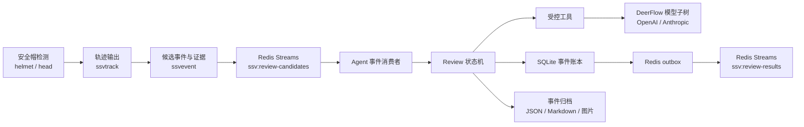

# DeerFlow 安全帽复验链路设计

## 背景

当前实时链路使用 `ssvinfer` 输出 `helmet` 和 `head` 两类检测，并由 `ssvtrack` 输出轨迹。实际运行配置使用 TensorRT 安全帽模型及 `config/model-labels/helmet.txt`，其中 `head` 明确表示未佩戴安全帽的头部，`helmet` 表示已佩戴安全帽的头部。

现有 `ssvpub` 将逐帧检测写入 `ssv:events`，Python Agent 仅消费 JSON、记录日志并确认消息。该消息不包含候选业务事件、触发前后关键帧或复验状态，无法让大模型对真实视频证据进行复验。

本设计在 T3 与 T4 边界建立完整链路：从 `head` 轨迹聚合候选事件、在实时链路中归档证据、通过 Redis Streams 异步交给 Agent、使用原样迁入的 DeerFlow 最小子树调用 OpenAI 或 Anthropic 视觉模型，并输出可机器消费与可人工阅读的规则化结果。

## 目标

1. 对每个满足条件的连续 `head` 轨迹片段生成唯一候选事件；Agent 在线期间接收的每个候选事件必须经过视觉模型复验。
2. 在视频实时链路中保存触发点前后可复核的证据，而不让 Python Agent 进入每帧检测路径。
3. 使用 DeerFlow 原始模型、工具、反射与追踪基础设施的最小可运行闭包；可直接搬运的上游文件保持原样。
4. 同时兼容 OpenAI-compatible 视觉模型与 Anthropic 视觉模型，并且每个候选事件只使用当前配置选中的一个 provider。
5. 输出受 Pydantic 校验的 JSON、中文 Markdown 摘要、CLI 实时结果以及 `ssv:review-results` Stream 消息。
6. 使用 SQLite 账本和 Redis outbox 实现幂等、崩溃恢复、结果补发与模型调用去重。

## 非本阶段范围

1. 通用对话 Agent、Lead Agent、Sub-Agent、MCP 动态工具、Sandbox、Skills 安装与跨会话 Memory。
2. 向量数据库、历史案例检索、外部通知、工单、短信和 Web 前端。
3. 多模型仲裁、模型自动选择和模型自主工具规划。
4. 多机部署、PostgreSQL 迁移和高可用治理。

## 总体架构



`ssvevent` 位于 `ssvtrack` 与 `ssvpub` 之间。实时线程维护轨迹片段和有限帧缓冲；后台证据线程生成证据目录；后台候选发布器仅在证据目录或明确的证据失败记录完成后写入 `ssv:review-candidates`。`ssvpub` 保持逐帧检测调试流 `ssv:events` 的发布职责，不作为 Agent 复验输入，也不发布候选事件。两个插件复用 `ssv-common` 中的 Redis Streams 发布组件。

`./ssv agent` 只以独立 consumer group 消费 `ssv:review-candidates`，绝不订阅或打印逐帧检测调试流 `ssv:events`。候选事件已按连续轨迹片段去重，因此一段轨迹最多触发一次 Agent 复验。

## 层级边界

系统按以下单向边界组织：

1. T2 感知层的 `ssvinfer`、`ssvtrack` 和 `ssv_meta` 保持既有 `helmet/head` 检测与轨迹语义，不感知规则、证据、LLM 或复验结果。
2. T3 事件层的 `ssvevent` 只把 `head` 轨迹转换为候选事件和证据，并异步发布候选；不得调用 Python、DeerFlow、视觉模型或 Agent 状态机。
3. T4 Agent 层只消费完整候选事件与 evidence manifest；不得读取实时视频流、参与逐帧判断或反向控制 GStreamer pipeline。
4. 原样迁入的 DeerFlow 子树只提供模型、配置、反射、追踪和工具基础设施；不得 import `ssv_agent`，也不得包含 `head`、`helmet`、Redis、SQLite、证据目录或业务规则。
5. YAML、规则文件、Redis candidate/result schema 和 evidence manifest 是 T3/T4 唯一共享接口。任何字段变更必须同步本 spec 和跨语言契约测试。
6. `ssvpub` 只发布逐帧检测调试流；不得承担候选判定或证据写入。状态机只依赖领域端口协议，不直接依赖 Redis、SQLite、文件系统或 DeerFlow。

## 候选事件规则

候选规则为 `head_without_helmet_v1`，以 `head` 轨迹为主键，不对 `head` 与 `helmet` 进行空间匹配。

1. 同一 `source + track_id` 的 `head` 有效观测持续至少 1 秒。
2. 片段内至少有 3 次有效观测。
3. 达到条件后以 `source_id + pipeline_generation + track_id + episode_started_pts_ns + rule_id + rule_version` 计算 UUIDv5 形式的唯一 `event_id`，并且对该连续片段只触发一次模型复验。
4. 轨迹终止，或连续 2 秒未观察到该 `head` 后关闭片段；之后重新出现的轨迹可以生成新事件。
5. `helmet` 是已佩戴安全帽的独立检测类别，可作为模型上下文，不是候选规则的几何配对条件。

规则文件位于 `config/agent-rules/head_without_helmet_v1.yaml`，包含规则 ID、版本、候选阈值、证据策略、模型提示词版本与默认处置建议。T3 使用其中的候选与取帧字段，T4 使用同一规则 ID/版本生成复验上下文和结果。

模型返回 `confirmed_no_helmet` 或 `rejected` 时，只有 `review_confidence >= 0.80` 才可进入相应自动终态；低于该阈值统一收敛为 `needs_human_review`，同时保留模型原始建议与置信度。该阈值由 `head_without_helmet_v1.yaml` 版本化管理。

## 证据采样与归档

候选事件达到持续阈值时，以触发点 `t0` 为中心维护前后各 1 秒窗口。事件在后 1 秒窗口完成后固化证据。

必须选择最多 5 个时间锚点：`before_far`（`t0 - 1.0s`）、`before_near`（`t0 - 0.5s`）、`trigger`（`t0`）、`after_near`（`t0 + 0.5s`）和 `after_far`（`t0 + 1.0s`）。`trigger` 必须保存真正触发候选的那一帧，不以质量分替换；其余锚点在目标时刻 ±250ms 的候选帧中，按规则 YAML 的归一化质量评分选择一帧：图像清晰度 0.30、目标框面积 0.25、检测置信度 0.20、轨迹稳定性 0.15、距目标时刻接近度 0.10。五个固定目标时刻提供时间多样性，首版不引入图像相似度阈值。某锚点无候选帧时，在 manifest 标记缺失，不以相邻锚点重复帧填充。每个可用时间点保存全景帧和 `head` 裁剪图。

`head` 裁剪以对应锚点的 `head` 检测框为基准，向四边各扩展原框宽度和高度的 25%，再钳制到图像边界；保存裁剪所得的原始像素，不放大、不补背景。若裁剪图任一边小于 64 像素，仍归档和发送，但在 manifest 标记为低分辨率；模型应据此倾向 `needs_human_review`。

事件目录为：

```text
artifacts/events/<event_id>/
  candidate.json
  evidence-manifest.json
  evidence/
  result/
```

`evidence-manifest.json` 是模型证据的权威索引，记录锚点、实际时间、相对偏移、全景和裁剪文件相对路径、`head` 框、裁剪低分辨率标记、置信度、轨迹状态、质量分数和文件 SHA-256。首版 `ssvevent` 与 Agent 运行在同一主机或挂载同一事件目录。目录先写入临时位置，完整 manifest 生成后原子发布。

证据任务使用有界异步写入队列，最多保留 8 个任务或 64 MiB 的深拷贝帧数据。队列满、JPEG 编码失败或磁盘故障时，实时线程立即释放资源；后台任务写出包含 `evidence_unavailable` 原因的最小 `candidate.json` 并发布候选。Agent 仍调用模型复验已有证据；无法得到可靠结论时结果收敛为 `needs_human_review`。

候选目录完成后交给后台 Redis 发布器。Redis 暂不可用时，目录保留为本地发布待办，发布器按有限退避重试；成功发布后写入发布完成状态。证据写入或 Redis 故障均不得阻塞视频实时线程。

## Redis 契约

三个 Stream 均沿用既有 `ssvpub` 的单字段外壳：`XADD <stream-key> * event <event-json>`。候选与结果的所有业务字段都编码在 `event` 的 JSON 值中；Redis Stream entry ID 仅用于 consumer group 的读取、ACK、过期处理和排障，不是业务 `event_id`，也不进入跨语言 JSON 契约。`ssvevent` 发布的候选 JSON 的 `type` 固定为 `review_candidate`，Agent outbox 发布的结果 JSON 的 `type` 固定为 `review_result`。现有 `ssv:events` 继续使用 `type: detection`，语义不变。

候选与结果 JSON 的 `schema_version` 首版固定为整数 `1`；未来只有出现不向后兼容的字段或语义变化时才递增。

### 复验候选流

`ssv:review-candidates` 的消息包含：

- `schema_version`、`event_id`、`source`、`track_id`；
- `rule_id`、`rule_version`、`candidate_class`；
- `pipeline_generation`、`episode_started_at_ms`、`triggered_at_ms`；
- `episode_started_pts_ns`、`triggered_pts_ns`、`duration_ms`、`observation_count`；
- `evidence_manifest_path`；
- `evidence_coverage.expected_anchor_count` 与 `evidence_coverage.available_anchor_count`。

候选消息不内嵌图片或 Base64 数据。`evidence_manifest_path` 必须是相对于 `artifacts.events_root` 的 `<event_id>/evidence-manifest.json`，不得使用绝对路径或上级目录遍历。`read_evidence` 对路径规范化后，必须验证其仍在 `artifacts.events_root` 内，且路径中的事件目录与 JSON `event_id` 完全一致；不满足时拒绝读取并收敛为人工复核。

所有 `*_at_ms` 均为 Unix epoch 毫秒，供展示和跨系统关联；所有 `*_pts_ns` 均为 GStreamer PTS 纳秒，只与同一 `source + pipeline_generation` 的媒体时间线组合解释。时间字段均为 JSON 整数。`event_id` 使用 `episode_started_pts_ns`，而非墙上时间，避免时间同步变化影响同一连续片段的确定性标识。

### 复验结果流

`ssv:review-results` 是不可变追加流，结果至少包含：

- `schema_version`、`event_id`、`source`、`track_id`；
- `rule_id`、`rule_version`、`prompt_version`；
- `decision`：`confirmed_no_helmet`、`rejected` 或 `needs_human_review`；
- `review_confidence`、`needs_human_review`、`evidence_anchor_ids`、`evidence_summary`；
- `primary_reason_code`、`recommended_action`、`reasoning_summary`；
- `provider`、`model`、`result_revision`、`completed_at_ms`。

下游以 `event_id + result_revision` 幂等消费。`reasoning_summary` 仅保存可审计的证据说明，不保存模型隐藏推理过程。

首版首次发布的结果使用整数 `result_revision: 1`。同一 SQLite outbox 结果的重复发送仍使用 revision `1`，不得因 Redis 重试而递增。首版不支持模型结果再次复验或人工回写，因此不会产生更高 revision；未来增加人工更正时，才允许以同一 `event_id` 发布递增的 revision。

`primary_reason_code` 是单一、稳定的机器可读枚举。`confirmed_no_helmet` 只能使用 `no_helmet_visible`；`rejected` 只能使用 `helmet_visible`；`needs_human_review` 使用 `low_confidence`、`evidence_unavailable`、`evidence_insufficient`、`evidence_conflicting`、`head_not_visible`、`provider_unavailable` 或 `invalid_model_output` 之一。中文说明仅写入 `evidence_summary` 与 `reasoning_summary`，下游不得解析中文文本判断处置。

### 实时消费边界

首版只复验 Agent 运行期间实时到达的候选。新建 `ssv:review-candidates` consumer group 时从 `$` 开始，不回放建组前的 Stream 历史。Agent 每次启动记录启动时刻；启动前写入但尚未消费的消息，以及旧 consumer 遗留的 pending 消息，均写入 SQLite 为 `expired` 审计记录后 ACK，不读取证据、不调用模型，也不写入 `ssv:review-results`。首版固定单 worker，在线期间到达的候选按 Stream 顺序串行复验；模型调用和排队等待不设置固定时限。运行日志在 `DEBUG` 级别记录候选到达间隔、模型调用耗时、队列积压量和最老待处理候选年龄，以实测数据决定后续是否提升为受控并发。首版不实现停机积压候选的时效窗口、pending 认领后复验或历史补处理。

## Agent 状态机与可靠性

状态机只依赖领域契约和端口协议，不直接依赖 Redis、SQLite、文件系统或 DeerFlow：

```text
pending → claimed → loading_evidence → calling_model → validating_result
        → completed | manual_review
        ↘ failed（可恢复处理失败，不发布业务结论且不 ACK）
```

`completed` 与 `manual_review` 是可发布的业务终态：前者的 `decision` 只能是 `confirmed_no_helmet` 或 `rejected`，后者的 `decision` 必须是 `needs_human_review`。`failed` 仅表示当前处理因基础设施或配置问题无法完成；它不是持久业务结论，不写入 `ssv:review-results`，输入消息保持未 ACK，待依赖在本次 Agent 运行期间恢复后重试当前处理。若服务重启，该旧 pending 依照“实时消费边界”写为 `expired`，不再恢复复验。

处理规则：

1. SQLite 以 `event_id` 原子领取事件；已有终态不重复模型调用，仅执行结果补发和 ACK。
2. 仅在成功写入 `completed` 或 `manual_review`，并持久化相应 SQLite outbox 后确认 Redis 输入消息。
3. 超时、429 和 5xx 按有限退避重试；重试耗尽后收敛为 `manual_review`。配置错误、SQLite 不可用或无法生成结果归档时进入 `failed`，不确认输入消息，等待人工修复依赖后重试。
4. 结构化输出无效时允许一次修复请求；仍无效进入 `manual_review`。
5. 模型不可用、证据不足或模型不确定时进入 `manual_review`，并输出原因。
6. SQLite 不可用时不确认输入消息，避免丢失或重复模型调用。
7. 结果先落 SQLite outbox，再发布 `ssv:review-results`。Redis 结果发布暂不可用不构成 `failed`：已持久化结果可由 outbox 补发，输入可安全 ACK；进程中断后可重发结果，不重新调用模型。
8. OpenAI 与 Anthropic 仅作为可替换 provider；本阶段不并行调用、仲裁或自动故障切换到另一家 provider。
9. `agent.review_model` 在 Agent 服务启动时确定；切换 provider、模型名或 endpoint 后必须重启 Agent，确保同一事件的重试、恢复和审计不跨模型漂移。
10. 首版固定为单 Agent 进程和单复验 worker，不实现多 worker 并发调度；服务重启后仅处理新到达的候选，旧 pending 仅作过期审计和 ACK，不恢复模型复验。

## DeerFlow 原样迁入与 SSV 适配

迁入的代码放在 `agent/src/deerflow/`，保留上游相对目录和绝对 import。最小迁入闭包覆盖模型 factory、OpenAI/Anthropic provider、模型/工具配置、反射、工具基础类型与 trace 上下文。完整文件列表、来源路径、SHA-256、上游仓库、上游 commit 和升级流程写入 `docs/DeerFlow迁移说明.md`，并在 `agent/src/deerflow/UPSTREAM_MANIFEST.json` 固化。

DeerFlow 原样子树不得 import `ssv_agent`。`agent/src/ssv_agent/review/deerflow_adapter.py` 是唯一允许 import `deerflow.*` 的 SSV 文件，负责：

1. 将 SSV YAML 模型配置映射为 DeerFlow `ModelConfig`。
2. 选择支持视觉输入的 OpenAI-compatible 或 Anthropic provider。
3. 将 `EvidenceBundle` 与规则上下文转换为 provider 所需的图像消息。
4. 将模型响应转换为 `ReviewDecision` 并交由 Pydantic 校验。

模型扩展保留 DeerFlow 原始机制：`agent.models[].use` 是 provider class path，由原样迁入的 `ModelConfig`、`reflection.resolve_class()` 和 `create_chat_model()` 解析。首版模板仅接入 OpenAI-compatible 与 Anthropic provider；后续新增 provider 通过安装对应依赖并添加模型配置完成，不要求修改状态机或工具协议。运行配置是受信任的本地管理员输入，不向不受信任用户开放 `use` 字段。

## 工具系统

工具由状态机以固定顺序调用，模型不能自主枚举工具、传入任意路径或触发副作用：

```text
resolve_rule → read_evidence → review_vision → render_review_artifact
```

本阶段实现四个注册工具：

1. `resolve_rule`：按已发布的规则 ID 和版本读取 YAML 规则。
2. `read_evidence`：按事件和 manifest 校验受限相对路径、事件目录和 SHA-256，加载图片与元数据。
3. `review_vision`：使用 DeerFlow 模型子树调用 OpenAI 或 Anthropic 视觉模型，返回规范化决策。
4. `render_review_artifact`：依据结构化决策确定性生成 `review-result.json` 和 `review-summary.md`。

SQLite 状态迁移和 Redis outbox 是基础设施能力，不暴露给模型。通知、向量检索、外部工单和多模型仲裁不在本阶段实现。

## 目录边界

新增 SSV 领域代码收敛在 `agent/src/ssv_agent/review/`：

- `contracts.py`：Pydantic 领域契约；
- `ports.py`：`ReviewStore`、`ReviewTool`、`ResultPublisher` 等协议；
- `service.py`：单事件复验应用服务；
- `state_machine.py`：纯状态迁移；
- `store.py`：SQLite 实现；
- `outbox.py`：Redis 结果发布和补发；
- `deerflow_adapter.py`：唯一框架耦合点；
- `tools/`：四个领域工具及注册表。

T3 新增 `gst/ssv-event/`，在单个插件内包含片段聚合、帧缓冲、证据选择、证据写入、候选 payload 生成和后台候选发布，避免首版将强关联状态拆散到多个插件。`gst/ssv-common` 增加可复用的 Redis Streams 发布组件；`ssvpub` 继续使用该组件发布逐帧检测调试流。

## 配置

`config/ssv.example.yaml` 新增：

- `redis.review_candidate_stream`：默认 `ssv:review-candidates`；
- `redis.review_result_stream`：默认 `ssv:review-results`；
- `artifacts.events_root`：默认 `artifacts/events`，由 `ssvevent` 与 Agent 共同使用；
- `agent.rules_path`：默认 `config/agent-rules`；
- `agent.ledger_path`：默认 `artifacts/agent-review.sqlite3`，只存放 Agent SQLite 账本与 outbox；
- `agent.review_model`：选中的视觉模型名；
- `agent.models`：尽量保持 DeerFlow `ModelConfig` 字段形式的模型列表。

`agent.models` 的每项直接保留 DeerFlow `ModelConfig` 的 `name`、`use`、`model` 字段及 provider 构造参数，不增加 SSV 自定义的 `provider` 枚举。OpenAI-compatible 项使用 `use: langchain_openai:ChatOpenAI`、`api_key: $SSV_AGENT_OPENAI_API_KEY`、可选 `base_url: $SSV_AGENT_OPENAI_BASE_URL` 和 `supports_vision: true`；Anthropic 项使用 `use: langchain_anthropic:ChatAnthropic`、`api_key: $SSV_AGENT_ANTHROPIC_API_KEY` 和 `supports_vision: true`。`$SSV_AGENT_*` 仅是 DeerFlow 原始 `api_key`、`base_url` 字段的环境变量值来源。密钥不得写入 YAML、SQLite、Redis、归档文件或日志。

`agent.review_model` 在 Agent 服务启动时解析为唯一 provider/model。配置变更通过重启 Agent 生效，不支持运行中切换。

`review_vision` 将 manifest 中已验证的全景图和头部裁剪图编码为 provider 请求图像内容；请求不包含本机文件路径、SQLite 状态或密钥。首版允许将这些视频证据发送至配置的云端 OpenAI 或 Anthropic endpoint，也允许 OpenAI-compatible 配置指向本地视觉模型服务。

`vision_review_v1.md` 使用中文指令：模型只能依据给出的时间锚点图像、`head` 检测摘要和规则正文判断；必须返回固定 JSON schema，并引用实际 `anchor_id` 作为证据。`evidence_anchor_ids` 是按时间顺序排列的字符串数组，必须全部存在于 manifest；Agent 校验后才可发布结果。头部遮挡、画面模糊、证据冲突或无法确认时必须返回 `needs_human_review`；不得把 `head` 检测直接当作最终事实，也不得编造未提供的画面内容。JSON 枚举保持英文，`primary_reason_code` 必须使用本 spec 规定的枚举，`evidence_summary`、`recommended_action` 和 `reasoning_summary` 使用中文。系统不请求或保存隐藏推理过程。

每次模型复验最多发送 10 张图，即五个时间锚点各一张全景图和一张头部裁剪图；保持当前分析尺寸，不额外放大。单张 JPEG 最大 1 MiB，总图像 payload 最大 10 MiB。超出预算时按质量分数保留锚点与裁剪图，并在 manifest 中记录被裁减的原因。

## 呈现方式

每个可发布的业务终态结果同时呈现为：

1. `ssv:review-results` 中的结构化消息；
2. `./ssv agent` 的中文 CLI 实时摘要；
3. 事件目录中的 `result/review-result.json`；
4. 事件目录中的 `result/review-summary.md`。

首版不实现 Web 页面。后续 UI、通知和报告服务以结果 Stream 与事件归档为唯一输入。

CLI 的 `INFO` 级别仅在 `completed` 或 `manual_review` 业务终态输出一条中文摘要；当前处理进入 `failed` 时以 `ERROR` 输出可恢复故障说明，但不伪装为业务结论。`DEBUG` 级别可输出领取、证据读取、模型调用和发布等状态迁移。原始逐帧检测仅供 Redis 调试路径使用，不进入 Agent CLI 日志。

`DEBUG` 日志额外输出候选到达间隔、模型调用耗时、当前候选积压量和最老待处理候选年龄；这些指标只用于首版容量观测，不改变单 worker 的处理策略，也不进入逐帧检测输出。

首版不实现证据自动保留期、定时删除或运行时自动清理。事件目录和 SQLite 审计记录仅允许通过显式人工清理操作删除，实时 `ssvevent` 与 Agent 服务均不得删除既有归档。

## 验证方式

1. C++ 测试覆盖 `head` 轨迹的 1 秒/3 次触发、2 秒关闭、单片段去重、五锚点选择、25% 头部裁剪与低分辨率标记、缺证据与 manifest 哈希。
2. C++/Python 契约测试验证 Stream 单字段 `event` 外壳、`schema_version: 1`、`review_candidate` JSON 与 Pydantic 解析一致。
3. Python 单测覆盖原样迁入 manifest、DeerFlow `ModelConfig` 原始字段解析、四个工具、OpenAI/Anthropic mock、状态迁移、SQLite 幂等、过期候选跳过、`primary_reason_code` 和 `evidence_anchor_ids` 校验、outbox 补发。
4. 集成测试使用固定 `head` 候选、证据夹具和 mock 模型，验证 CLI、JSON、Markdown、SQLite 和结果 Stream 的完整闭环。
5. 真实模型验证仅在相应环境变量存在时执行；默认测试和 CI 不调用外部 API。

## 兼容性与回滚

现有 `ssv:events` 逐帧检测调试流保持不变。新增 `ssv:review-candidates` 与 `ssv:review-results`，不改变旧消费者语义。关闭 `ssvevent` 或不配置 Agent 复验时，实时检测、跟踪和原始 Redis 发布仍可独立运行。

回滚时移除 pipeline 中 `ssvevent` 装配并停止 Agent 服务即可；既有逐帧检测链路不依赖复验结果。已生成的事件目录、SQLite 账本与结果 Stream 保留为审计记录。
