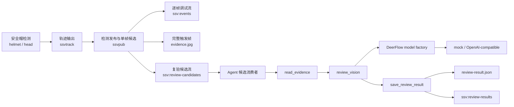

# DeerFlow 单帧安全帽复验 Demo 设计

## 文档定位

本文是独立的 T3/T4 Demo 设计，不替代、不修改
`docs/specs/2026-07-29-T3T4-DeerFlow安全帽复验链路-spec.md`。原文档继续描述完整的多帧事件与证据复验方案；本文只定义一个优先验证 DeerFlow 移植和视觉复验调用链的最小闭环。

本设计跨越两条主线：

- T3：在现有 `ssvpub` 中增加低频候选去重、单帧证据写入和候选发布。
- T4：迁入 DeerFlow 模型构建闭包，消费候选并完成一次固定流程的视觉复验。

跨主线接口包括 YAML 配置、`ssvpub` 插件属性、Redis candidate/result schema、证据相对路径和 Agent 输入输出。实现时必须同步契约测试。

## 背景

当前实时链路已经具备 `ssvinfer → ssvtrack → ssvpub`：

- 安全帽模型通过 `config/model-labels/helmet.txt` 输出 `helmet` 和 `head`；
- `ssvtrack` 为检测对象补充 `track_id`；
- `ssvpub` 将逐帧检测 JSON 发布到 `ssv:events`；
- Python Agent 消费检测消息并记录日志，尚未读取图像或调用视觉模型。

完整的多帧事件方案需要新增事件插件、轨迹片段规则、帧缓冲、多锚点证据、异步写入、可靠账本和结果补发。上述能力适合后续完整链路，但会扩大首个 DeerFlow 集成 Demo 的调试面。

本文先验证最短路径：安全帽模型产生一个有效 `head` 轨迹后，由现有 `ssvpub` 保存触发帧的完整图像并发布一次候选；Agent 通过迁入的 DeerFlow model factory 构造视觉模型，读取这一张图并输出结构化复验结果。

## 目标

1. 使用真实安全帽检测模型和 `head` 轨迹触发复验候选，不使用 `person` 或 `mock-detect` 代替业务输入。
2. 同一 `source + pipeline_generation + track_id` 在当前 generation 内只发布一次候选，避免逐帧调用视觉模型。
3. 从候选触发时的当前 BGR buffer 保存一张完整 JPEG，不裁剪、不缩放、不叠加检测框。
4. 保持原有 `ssv:events` detection 消息和消费者语义不变，新增独立的候选与结果 Stream。
5. 从固定 DeerFlow commit 迁入模型构建所需的最小 import 闭包，并通过原始 `ModelConfig`、反射和 `create_chat_model()` 创建模型。
6. Agent 按固定顺序完成证据读取、视觉复验和结果保存，不启用模型自主 tool calling。
7. 使用 DeerFlow factory 加载可控 mock vision provider 跑通默认 Demo；配置真实 OpenAI-compatible 视觉模型时可执行外部 smoke。

## 非本阶段范围

1. 新增 `ssvevent` 插件或修改原有完整 T3/T4 设计。
2. 轨迹持续时间、连续命中次数、episode 关闭和同一 generation 内 track ID 复用后的再次触发。
3. 触发前后帧、五时间锚点、环形帧缓存、目标裁剪、短视频和大模型二次抽帧。
4. `head` 与 `helmet` 的空间匹配、区域规则、严重级别和多事件规则引擎。
5. SQLite 账本、Redis outbox、自动 pending 认领、多 worker、跨进程强一致幂等和生产级重试调度。
6. DeerFlow Lead Agent、LangGraph 工作流、MCP、Skills、Sub-Agent、Memory、工具搜索、Sandbox provider 实现和通用对话能力。
7. Anthropic、多 provider 仲裁、模型自动选择和运行时 provider 切换。
8. Web 页面、外部通知、工单、知识检索和长期事件存储。

## 方案选择

本 Demo 直接扩展现有 `ssvpub`，不增加新的 GStreamer 插件。

选择该方案的原因是本阶段只有“首次有效轨迹 + 当前完整帧”两个状态：`ssvpub` 已同时拿到当前视频 buffer 和对应的 tracked snapshot，可以用最少的 T3 改动建立候选。随着后续加入多帧、前后窗口或二次取证，再按照完整设计迁移到独立 `ssvevent`。

## 总体架构



## 层级与职责边界

### T2 感知层

`ssvinfer`、`ssvtrack` 和 `ssv_meta` 保持既有检测、跟踪和 PTS/generation 语义，不增加复验规则或模型字段。

Demo 运行配置必须使用：

- 安全帽模型文件；
- `inference.label_map: config/model-labels/helmet.txt`；
- 空的 `inference.target_class`，使 `helmet` 和 `head` 都能进入跟踪结果。

### T3 `ssvpub`

`ssvpub` 保留原有逐帧 detection 发布，同时增加以下受限职责：

1. 从当前 tracked snapshot 中筛选有效 `head` 对象；
2. 对当前 generation 的 `track_id` 做内存去重；
3. 将当前完整 BGR buffer 编码为单张 JPEG；
4. 写入候选目录并发布 `review_candidate`。

`ssvpub` 不调用 Python、DeerFlow 或任何视觉模型，不读取历史帧，也不接收 Agent 的反向控制。

### T4 Agent

Agent 只消费 `ssv:review-candidates`，根据相对路径读取一张证据图片，经 DeerFlow factory 创建的模型完成一次结构化视觉复验。Agent 不订阅逐帧 `ssv:events`，不读取实时视频流，不要求 GStreamer 等待模型结果。

### DeerFlow 迁入子树

迁入代码位于 `agent/src/deerflow/`，保持上游相对目录、import 和文件内容不变。迁入子树不得 import `ssv_agent`；SSV 业务规则、Redis、证据路径、提示词和结果 schema 均位于 `ssv_agent`。

`agent/src/ssv_agent/review/deerflow_adapter.py` 是 SSV 中唯一允许 import `deerflow.*` 的文件。

## 候选触发与去重

### 有效候选

一个 tracked object 同时满足以下条件时可生成候选：

1. `class_name == "head"`；
2. `track_id >= 0`；
3. `track_state` 为 `SSV_TRACK_NEW` 或 `SSV_TRACK_MATCHED`；
4. bbox 四个归一化坐标有限且满足 `0 <= x1 < x2 <= 1`、`0 <= y1 < y2 <= 1`；
5. tracked frame 的 source、generation 和 PTS 与当前 `ssvpub` buffer 对齐；
6. tracked frame generation 等于 `ssv_meta(source)->generation()`。

`helmet` 对象可以继续出现在原始 detection JSON 中，但不参与候选触发或几何匹配。视觉模型必须重新判断完整画面中的目标头部是否佩戴安全帽，不能把 `head` 检测类别直接当作最终结论。

### 去重键

去重键固定为：

```text
source + pipeline_generation + track_id + rule_id + rule_version
```

其中：

```text
rule_id = head_without_helmet_single_frame
rule_version = 1
```

`event_id` 使用 RFC 4122 UUIDv5，由标准 URL namespace
`6ba7b811-9dad-11d1-80b4-00c04fd430c8` 和以下 canonical name 计算：

```text
ssv://review/<source>/<pipeline_generation>/<track_id>/head_without_helmet_single_frame/1
```

同一去重键在当前 `ssvpub` 进程和 generation 内只发布一次。检测到 generation 变化时，清空内存去重集合，新的 generation 可以为相同数字的 `track_id` 生成新事件。

只有 `evidence.jpg`、`candidate.json` 和 Redis 候选都成功后，去重键才进入已发布集合。证据或 Redis 发布失败时不标记完成，后续同一轨迹帧允许使用相同 `event_id` 重试。

同一帧包含多个首次出现的 `head track_id` 时，每个 track 分别生成事件目录和候选；它们可以引用内容相同但各自归档的完整帧 JPEG。

## 单帧证据

候选证据是触发时传入 `ssvpub` 的完整视频 buffer：

- 输入格式必须是现有 pipeline 已冻结的 `video/x-raw,format=BGR`；
- 保存当前分析分辨率，不裁剪、不缩放、不放大；
- 不绘制 bbox、类别文字或 overlay；
- 使用 JPEG quality `90`；
- 先写入临时文件，再原子重命名为 `evidence.jpg`；
- 计算最终 JPEG 字节的 SHA-256。

为压缩 Demo 实施范围，本阶段允许 `ssvpub` 在首次轨迹触发时同步完成一次 JPEG 编码、文件写入和候选发布。去重使该操作对同一 track 只发生一次；将这些操作迁移到有界后台队列属于完整链路阶段。

事件目录使用触发时的北京时间命名，固定为：

```text
artifacts/events/<YYYYMMDDTHHMMSS.mmm+0800>_<source>_g<generation>_t<track_id>_<event_id前8位>/
  candidate.json
  evidence.jpg
  review-result.json
```

例如：

```text
artifacts/events/20260730T112214.927+0800_camera-01_g3_t33_825101e7/
```

目录名仅用于人工检索和按触发时间排序；完整 UUIDv5 继续以 `event_id` 保存在
candidate、result 和 Redis 中，仍是去重和幂等的唯一业务 ID。`source` 在目录名中仅保留
`[A-Za-z0-9._-]`，其余字符替换为 `_`，防止路径穿越。`event_id` 不包含时间戳，重试继续
写入同一事件目录。

`review-result.json` 在 Agent 完成复验后创建。首版不创建 evidence manifest；单一 `evidence_path + evidence_sha256` 即为证据契约。

候选 schema_version 保持为 `1`。候选消息中的路径必须是相对于
`artifacts.events_root` 的 POSIX 路径：

```text
<事件目录名>/evidence.jpg
```

不得写入绝对路径或包含 `..`。路径必须刚好包含一个安全的事件目录名和 `evidence.jpg`；Agent `resolve()` 路径后必须验证最终文件仍位于配置的 events root 中，且父目录名与 evidence_path 的父目录一致。结果仍以 `event_id` 作为业务关联键。

## Redis 契约

三个 Stream 均使用现有单字段外壳：

```text
XADD <stream-key> * event <event-json>
```

### 原始检测流

`ssv:events` 的 `type: detection` payload、字段和空检测行为保持不变。该流不作为视觉复验输入。

### 复验候选流

默认 Stream 为 `ssv:review-candidates`。候选 JSON 固定包含：

```json
{
  "type": "review_candidate",
  "schema_version": 1,
  "event_id": "UUIDv5",
  "source": "camera-01",
  "pipeline_generation": 3,
  "frame_id": 128,
  "media_pts_ns": 6200000000,
  "timestamp_ms": 1785400000000,
  "track_id": 12,
  "rule_id": "head_without_helmet_single_frame",
  "rule_version": 1,
  "candidate_class": "head",
  "detection_confidence": 0.91,
  "bbox": [0.20, 0.10, 0.38, 0.32],
  "evidence_path": "<event_id>/evidence.jpg",
  "evidence_sha256": "64位小写十六进制",
  "evidence_width": 640,
  "evidence_height": 480
}
```

Redis entry ID 只用于 consumer group 和 ACK，不作为业务 ID。

### 复验结果流

默认 Stream 为 `ssv:review-results`。结果 JSON 固定包含：

```json
{
  "type": "review_result",
  "schema_version": 1,
  "event_id": "UUIDv5",
  "source": "camera-01",
  "track_id": 12,
  "rule_id": "head_without_helmet_single_frame",
  "rule_version": 1,
  "decision": "confirmed_no_helmet",
  "review_confidence": 0.93,
  "primary_reason_code": "no_helmet_visible",
  "evidence_summary": "目标头部清晰可见，未观察到安全帽。",
  "recommended_action": "生成未佩戴安全帽复验记录。",
  "provider": "mock",
  "model": "demo-vision",
  "completed_at_ms": 1785400001200
}
```

`decision` 只能是：

- `confirmed_no_helmet`；
- `rejected`；
- `needs_human_review`。

`primary_reason_code` 固定为：

- `no_helmet_visible`；
- `helmet_visible`；
- `low_confidence`；
- `evidence_unavailable`；
- `provider_unavailable`；
- `invalid_model_output`。

## DeerFlow 迁入范围

上游仓库固定为 `/mnt/work/deer-flow`，上游 commit 固定为：

```text
b68e1c686a0cb5a3780089d27354354533451d8e
```

源代码根为：

```text
backend/packages/harness/deerflow/
```

迁入闭包以以下入口为根：

- `deerflow.config.model_config.ModelConfig`；
- `deerflow.config.app_config.AppConfig`；
- `deerflow.models.factory.create_chat_model`；
- `deerflow.reflection.resolve_class`。

迁入这些入口在 import 时直接或间接需要的 `config/`、`models/`、`reflection/`、`tracing/`、`trace_context.py`、`constants.py` 和包初始化文件。由于上游 `AppConfig` 具有较大的配置 import 闭包，允许迁入其配置类型依赖，但不得因此迁入 Agent、工具执行器、MCP、Skills、Sub-Agent、Memory 或 Sandbox provider 实现。

`agent/src/deerflow/UPSTREAM_MANIFEST.json` 对每个迁入文件记录：

- `source_path`；
- `destination_path`；
- `upstream_commit`；
- `sha256`；
- `license: MIT`。

自动化测试逐项重算目标文件 SHA-256，并扫描迁入子树不存在 `ssv_agent` import。业务适配只能写在 `ssv_agent/review/deerflow_adapter.py`。

## 模型配置与调用

`config/ssv.example.yaml` 新增以下配置边界：

```yaml
redis:
  review_candidate_stream: "ssv:review-candidates"
  review_result_stream: "ssv:review-results"

artifacts:
  events_root: "artifacts/events"

review:
  enabled: false
  automatic_decision_min_confidence: 0.80

agent:
  review_model: ""
  models: []
```

`agent.models` 每项保留 DeerFlow `ModelConfig` 的核心形式：

```yaml
- name: "openai-vision"
  use: "langchain_openai:ChatOpenAI"
  model: "gpt-4.1-mini"
  supports_vision: true
  api_key: "$SSV_AGENT_OPENAI_API_KEY"
  base_url: "$SSV_AGENT_OPENAI_BASE_URL"
```

默认 Demo 使用 SSV 提供的 `MockVisionChatModel` class path，但仍必须经过 DeerFlow `resolve_class()` 和 `create_chat_model()` 创建。真实 smoke 将 `agent.review_model` 切换到 OpenAI-compatible 配置，并通过环境变量提供凭据。密钥不得进入 YAML、Redis、事件归档或日志。

Agent 启动时选择唯一 `review_model`，验证 `supports_vision: true`，并创建一个模型实例。本阶段不在运行中切换模型。

## Agent 固定流程与工具边界

本阶段模型可见工具数量为零：

```text
AppConfig.tools = []
```

Agent 只实现三个按固定顺序调用的内部能力：

```text
read_evidence → review_vision → save_review_result
```

### `read_evidence`

输入为经过 Pydantic 校验的候选对象，职责为：

1. 校验相对路径、events root 和 event 目录；
2. 读取 JPEG；
3. 重算 SHA-256 并与候选一致；
4. 返回 JPEG bytes 和图像元数据。

它不接受模型生成的路径，也不读取候选目录之外的文件。

### `review_vision`

职责为：

1. 将固定中文规则、候选 bbox/置信度摘要和一张 JPEG 构造成 LangChain vision message；
2. 调用 DeerFlow factory 创建的模型；
3. 使用 Pydantic structured output 得到 `ReviewDecision`；
4. 将低于 `automatic_decision_min_confidence` 的自动结论归一化为 `needs_human_review + low_confidence`。

提示词必须说明 `head` 是检测候选而不是最终事实；模型只能依据当前完整帧判断，不得编造其他时间点的画面。系统不请求或保存隐藏推理过程。

真实 OpenAI-compatible provider 必须在请求层传入由 `ReviewDecision` 生成的
JSON Schema：`response_format.type=json_schema`、固定 schema 名
`helmet_review` 且 `strict=true`。schema 固定 `decision`、数值
`review_confidence`、`primary_reason_code`、`evidence_summary` 和
`recommended_action`，并编码 decision 与 reason code 的一一对应关系。
提示词仅作语义约束，不能替代该请求层约束。若 provider 仍返回无法通过
Pydantic 校验的内容，Agent 使用同一证据执行一次只允许输出修正 JSON 的格式修复调用；
第二次仍非法才写入 `needs_human_review + invalid_model_output`。

### `save_review_result`

职责为：

1. 原子写入 `<event_id>/review-result.json`；
2. 尝试发布 `review_result` 到结果 Stream；
3. 在结果文件成功落盘后允许 ACK 输入候选。

Redis 发布和文件写入由确定性代码执行，不暴露为模型工具。

## 幂等与失败语义

### T3 去重

`ssvpub` 在候选归档和 Redis 发布成功后记录去重键，阻止同一轨迹逐帧重复产生候选。该集合仅在当前进程和 generation 内有效。

### T4 去重

Agent 在调用模型前检查 `<event_id>/review-result.json`：

- 文件不存在：执行完整复验；
- 文件存在且 `event_id`、schema 和候选一致：不再次调用模型，只尝试补发已有结果；
- 文件存在但内容不一致或损坏：记录错误，不调用模型，不 ACK。

本机制避免常见的 Redis 重投导致重复模型调用，但不提供 SQLite 事务级 exactly-once 保证。

### 失败处理

1. `ssvpub` JPEG 写入失败：不写 candidate、不发布、不标记去重，下一帧允许重试。
2. candidate JSON 写入失败：不发布、不标记去重。
3. Redis candidate 发布失败：保留完整事件目录，不标记去重，下一帧使用同一 `event_id` 重试。
4. Stream 外壳、JSON 或必需身份字段非法：记录错误，不调用模型、不生成结果、不 ACK，保留 pending 供人工排查。
5. 候选身份合法但证据路径越界、SHA-256 不一致或 JPEG 不可读：生成 `needs_human_review + evidence_unavailable`。
6. provider 调用异常：生成 `needs_human_review + provider_unavailable`。
7. structured output 无效：生成 `needs_human_review + invalid_model_output`。
8. 自动结论低于阈值：生成 `needs_human_review + low_confidence`。
9. `review-result.json` 写入失败：不发布结果、不 ACK 候选。
10. 结果 Stream 发布失败：保留结果文件、记录错误并 ACK 候选；结果文件是本 Demo 的权威结果，结果 Stream 只提供实时展示，不在本阶段提供可靠补发保证。

只有合法的 `review-result.json` 已经存在时，Agent 才 ACK 输入候选。结果 Stream 发布成功不是 ACK 的前置条件。

## 配置与插件属性

`review.enabled` 默认 `false`，确保未配置 Demo 时原有 detection 链路不产生证据文件或候选。

`scripts/pipeline.sh` 在启用 review 时向现有 `ssvpub` 传入：

- `review-enabled=true`；
- `review-stream-key=<redis.review_candidate_stream>`；
- `events-root=<artifacts.events_root>`。

`ssvpub` 不增加可配置候选类别，本设计固定只识别 `head`，避免 Demo 配置漂移到 `person` 或其他类别。

## Demo 运行方式

默认 Demo 的检测侧必须具备：

- 可用安全帽模型；
- `config/model-labels/helmet.txt`；
- 包含至少一个未佩戴安全帽目标的视频源；
- Redis；
- 可写的 events root。

默认 Demo 的 Agent 模型侧使用经 DeerFlow factory 创建的 mock vision provider，因此不需要外部 API key。其目的在于可重复验证：真实安全帽模型产生 `head` 轨迹、`ssvpub` 只生成一个单帧候选、Agent 经 DeerFlow factory 完成一次模型调用并输出结果。

真实 provider smoke 仅将 Agent 模型配置切换到 OpenAI-compatible endpoint，不改变 T3 候选或证据格式。

建议运行顺序：

```bash
./ssv redis
./ssv build
./ssv agent
./ssv run
```

Demo 成功后应观察到：

1. `ssv:events` 继续出现逐帧 detection；
2. 同一 `head track_id` 在 `ssv:review-candidates` 中只出现一个业务 `event_id`；
3. 对应事件目录包含一张完整 `evidence.jpg` 和 `candidate.json`；
4. Agent 日志出现一次该事件的中文复验摘要；
5. 事件目录生成 `review-result.json`；
6. `ssv:review-results` 出现一个对应结果。

## 验证方式

### C++

1. 纯函数测试覆盖有效 `head`、无效 track、`NEW/MATCHED`、generation 变化和多个 track。
2. 固定输入验证 UUIDv5 和 candidate JSON 字段。
3. 合成 BGR buffer 验证 JPEG 保存的是完整帧尺寸、没有裁剪或缩放，且 SHA-256 可复算。
4. 重复相同 track 的连续帧只成功发布一次；候选发布失败后下一帧可以重试。
5. 原有 `ssv_pub_build_event_payload()` detection 测试逐字段保持不变。

### Python

1. DeerFlow manifest/hash、commit、许可证和禁止反向 import 测试。
2. `ModelConfig/AppConfig/resolve_class/create_chat_model` 的 mock provider 构建测试。
3. candidate/result Pydantic schema、相对路径和 SHA-256 校验测试。
4. `read_evidence`、`review_vision`、`save_review_result` 定向测试。
5. 低置信度、provider 异常、无效结构化输出和结果文件损坏测试。
6. 同一候选重复到达时模型只调用一次。

### 集成

使用真实安全帽检测模型和测试视频验证 T3 单帧候选；使用 DeerFlow mock provider 验证 Redis candidate 到结果文件、CLI 摘要和结果 Stream 的闭环。外部视觉模型 smoke 只在 endpoint 和 API key 已配置时运行。

## 兼容性与回滚

1. `review.enabled: false` 时，`ssvpub` 行为与当前基线一致，不创建事件目录，不发布 review candidate。
2. 原 `ssv:events` schema 不变，旧消费者不需要修改。
3. 回滚时关闭 `review.enabled` 并停止 Agent 即可；无需修改 `ssvinfer`、`ssvtrack` 或 `ssv_meta`。
4. 已生成的事件目录和结果 Stream 不自动删除，保留供 Demo 排障。

## 后续演进

当 Demo 验证 DeerFlow factory、视觉输入和结构化结果稳定后，再回到完整 T3/T4 设计推进：

1. 将事件与证据职责从 `ssvpub` 迁移至独立 `ssvevent`；
2. 增加轨迹持续规则和 episode 语义；
3. 增加触发前后多帧、短片段和按需补充证据；
4. 引入 SQLite/outbox、pending 恢复和受控并发；
5. 增加规则检索、二次抽帧和通知等受控 Agent 工具。
